<div align="center">

# NestIdP

**A self-hosted SAML 2.0 Identity Provider you deploy in minutes**

[](package.json)
[](package.json)
[](package.json)
[](LICENSE)
[](docs/proposal.MD)

One Docker image. One admin console. Identity from your REST API. Assertions to your apps.

</div>

---

## Why NestIdP?

You need to add SSO to Grafana, a custom app, or a SaaS product — but you already have users in an internal REST API, Active Directory proxy, or HR system and don't want to migrate them or stand up a heavyweight platform.

|                           | **NestIdP**                          | Keycloak                                   | Authentik                 | Lemonldap-NG           |
| ------------------------- | ------------------------------------ | ------------------------------------------ | ------------------------- | ---------------------- |
| **Deployment**            | Single Docker image, embedded DB     | Requires Postgres/MySQL, multiple services | Requires Postgres + Redis | Requires MySQL + Redis |
| **Identity source**       | Pull from any JSON REST API via sync | LDAP/Kerberos/social, own user DB          | LDAP/social, own user DB  | LDAP, own user DB      |
| **Encrypted embedded DB** | libSQL file, no DB server            | ✗                                          | ✗                         | ✗                      |
| **Setup time**            | < 5 min (`docker compose up`)        | 30–60 min                                  | 20–40 min                 | 30–60 min              |
| **Config surface**        | Purpose-built admin console          | Extensive realm settings                   | Python expressions        | Perl/YAML rules        |
| **Protocol scope**        | SAML 2.0 only                        | SAML + OIDC + OAuth2                       | SAML + OIDC + OAuth2      | SAML + OIDC + CAS      |
| **Cert auto-rotation**    | Built-in, per-cert                   | Plugin/manual                              | Manual                    | Manual                 |

> **NestIdP is the right choice when:** you need SAML SSO, your users live in an existing REST API, and you want something you can `docker compose up` without a DBA on call.

---

## What you get

| Surface            | Path                | Description                                                                    |
| ------------------ | ------------------- | ------------------------------------------------------------------------------ |
| **Admin console**  | `/admin`            | Configure identity sources, SP connections, IdP certificates, audit log        |
| **SAML login**     | `/login`            | End-user sign-in during SP-initiated SSO (no standing session after assertion) |
| **SAML endpoints** | `/saml/*`           | Metadata, HTTP-Redirect SSO, signed + optionally encrypted assertions          |
| **Identity sync**  | `/api/admin/sync/*` | Pull users, groups, roles, bcrypt hashes from one or more REST APIs            |
| **Health probes**  | `/health` `/ready`  | Liveness + readiness for load balancers and Kubernetes                         |

### Feature highlights

- **Multiple identity sources** — sync from several REST APIs independently; per-source scoping, collision handling, and scheduled cron runs
- **Signing + encryption certificates** — separate independent lifecycles; auto-rotation scheduler (opt-in); dual-cert metadata during rotation so SPs upgrade without downtime
- **Back-channel SLO** — propagate logout to every participating SP over SOAP with persistent retry queue
- **OAuth 2.0 client-credentials** — authenticate outbound sync calls via CC grant in addition to static bearer tokens
- **Per-connection outbound proxy** — route sync HTTP through a corporate proxy; per-connection no-proxy rules
- **Brute-force protection** — per-IP + per-username rate limits, DB-persisted lockout (survives restarts), IP escalation/ban
- **Full audit trail** — every auth, config change, sync run, and cert rotation recorded with actor, subject, and metadata; filterable and exportable
- **Encrypted at rest** — DB file (libSQL), bearer tokens, private keys — three independent keys

---

## How it fits together

Two connection types that must never be confused:

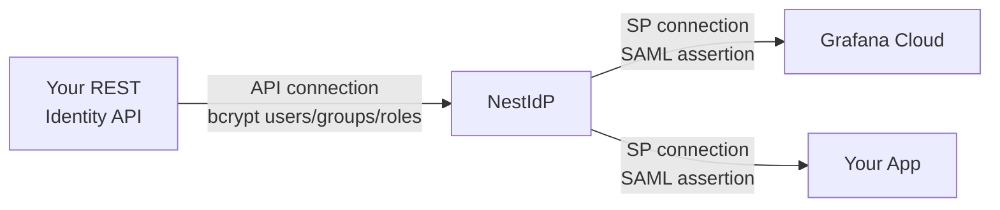

| Connection         | Direction          | What flows                                      |
| ------------------ | ------------------ | ----------------------------------------------- |
| **API connection** | External API → IdP | Users, groups, roles, password hashes (sync)    |
| **SP connection**  | IdP → Application  | Signed (+ optionally encrypted) SAML assertions |

### SP-initiated SSO flow

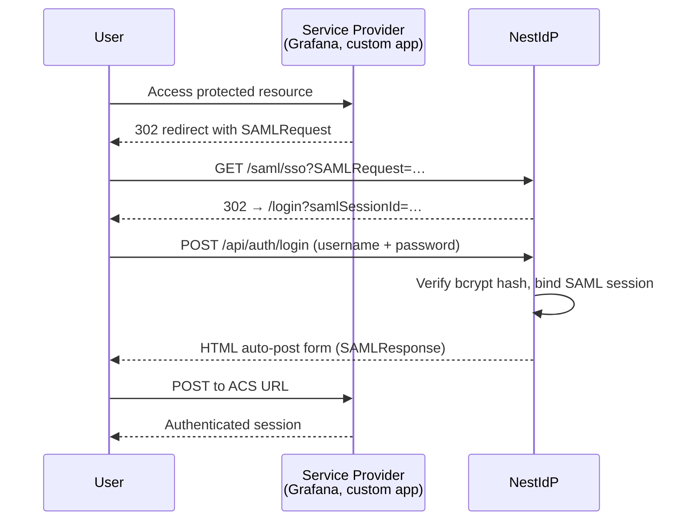

### Certificate roles (three distinct keys)

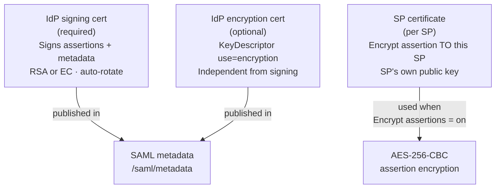

---

## Screenshots

<table>
<tr>
<td width="49%">

**Admin dashboard** — counts, last sync, IdP URLs

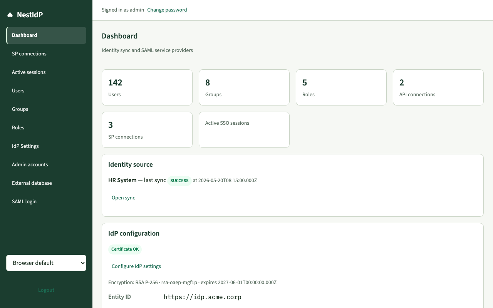

</td>
<td width="49%">

**Operator login** — separate from SAML login

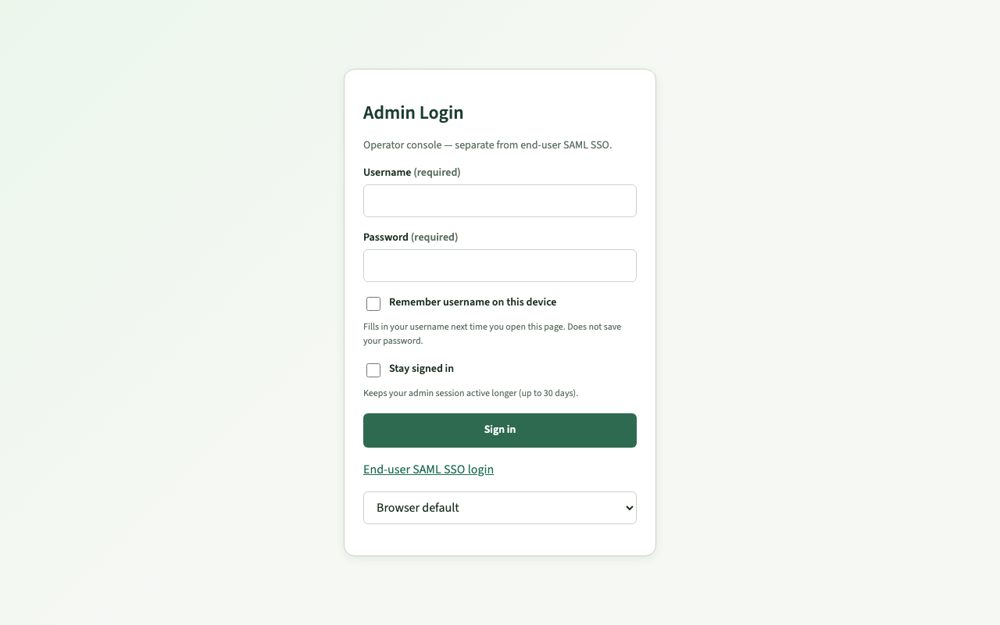

</td>
</tr>
<tr>
<td width="49%">

**IdP settings** — signing + encryption panels

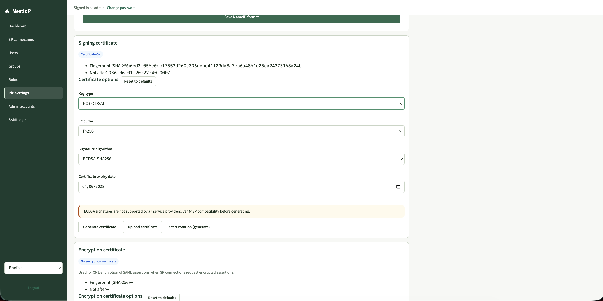

</td>
<td width="49%">

**Encryption cert options** — key type, transport algorithm

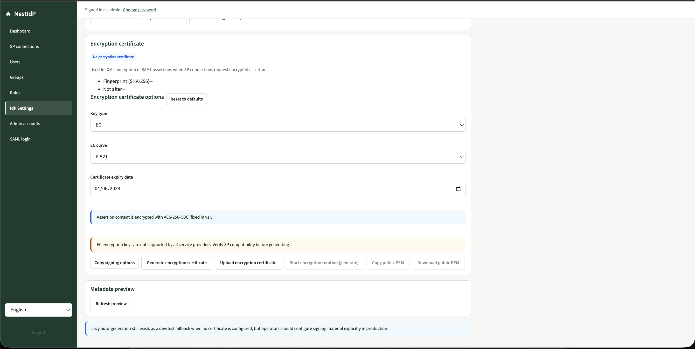

</td>
</tr>
<tr>
<td width="49%">

**API connections** — multiple sources with sync status

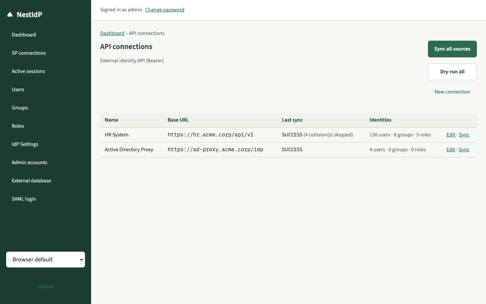

</td>
<td width="49%">

**Identity sync** — run + logs, dry-run, collision counts

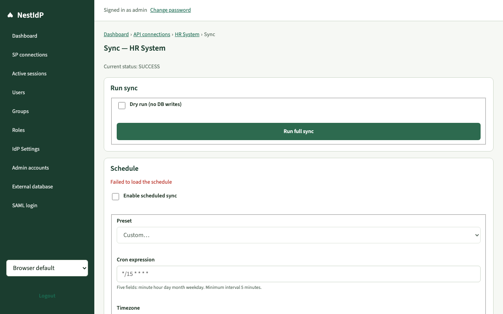

</td>
</tr>
<tr>
<td width="49%">

**SP connections** — register Grafana, SaaS, custom apps

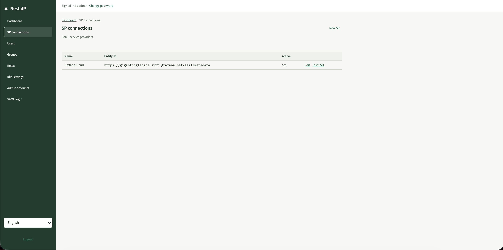

</td>
<td width="49%">

**Audit log** — filterable event stream with export

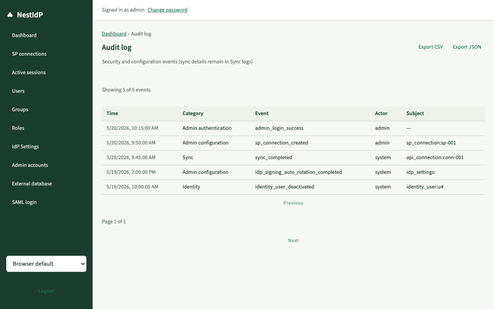

</td>
</tr>
<tr>
<td width="49%">

**SAML login** — end-user sign-in page during SP SSO

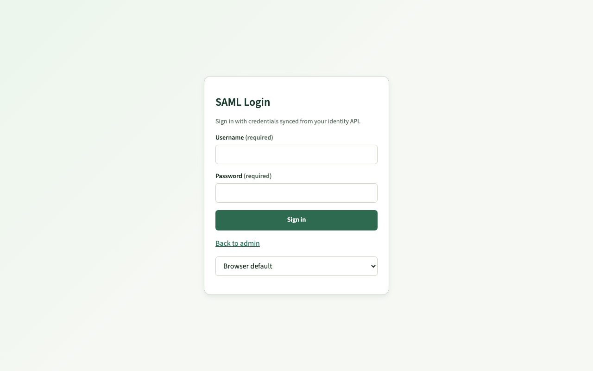

</td>
<td width="49%">

**Identity users** — paginated, multi-source, filterable

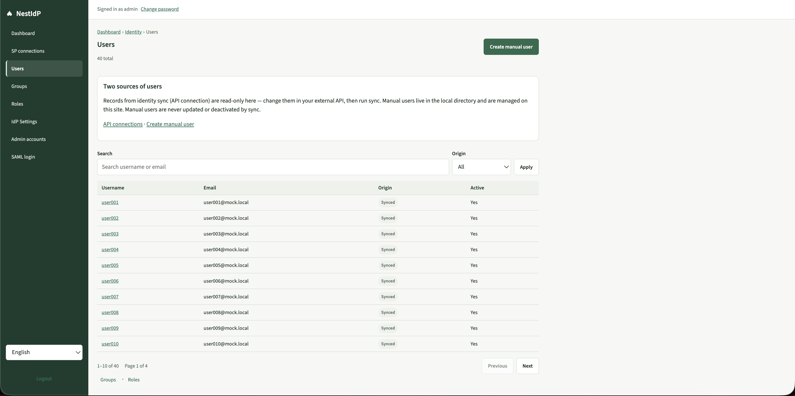

</td>
</tr>
</table>

Full operator walkthrough: [docs/tutorial.md](docs/tutorial.md)

---

## Quick start

<details>
<summary><strong>Local dev (Node + pnpm, no Docker)</strong></summary>

**Prerequisites:** Node.js ≥ 18, pnpm ≥ 9

```bash
git clone <your-repo-url> NestIdP && cd NestIdP
cp .env.example .env
# Edit .env: set ADMIN_USERNAME, ADMIN_PASSWORD, and ENCRYPTION_KEY
mkdir -p apps/api/data
pnpm install
pnpm db:migrate:deploy
pnpm dev
```

| URL                                 | What                 |
| ----------------------------------- | -------------------- |
| http://localhost:5173/admin/login   | Admin console        |
| http://localhost:5173/login         | SAML end-user login  |
| http://localhost:3000/saml/metadata | IdP metadata for SPs |
| http://localhost:3000/health        | Liveness probe       |
| http://localhost:3000/ready         | Readiness probe      |

Vite proxies `/api` and `/saml` to the NestJS API (port 3000) — use port 5173 for everything.

</details>

<details>
<summary><strong>Docker Compose (production-like)</strong></summary>

```bash
cp deploy/.env.docker.prod.example deploy/.env.docker.prod
# Edit deploy/.env.docker.prod — set strong values for:
#   SESSION_SECRET, ENCRYPTION_KEY, DATABASE_ENCRYPTION_KEY (openssl rand -hex 32 for each)
#   ADMIN_USERNAME, ADMIN_PASSWORD (min 12 chars in prod)
#   IDP_BASE_URL=https://idp.your-domain.com
pnpm docker:prod
pnpm docker:prod:logs   # follow startup logs
curl -sf http://localhost:3000/ready
```

Open http://localhost:3000/admin/login (or your `IDP_BASE_URL`).

For local hot-reload with Docker: `pnpm docker:dev` — Nest watch + Vite HMR at http://localhost:5173.

</details>

<details>
<summary><strong>Try sync with the mock identity API</strong></summary>

```bash
cd mock-app && pnpm install && pnpm start
# → http://localhost:4010  (40 users, groups, roles, bcrypt passwords)
```

In the admin console:

1. **API connection** → New → Name: `Mock HR`, Base URL: `http://localhost:4010`, Bearer: `mock-sync-dev-token` → **Test** → **Save**
2. **Sync** → **Run full sync** — expect ~40 users, 10 groups, 5 roles
3. SAML login → sign in as `user001` / `MockPass123!`

Users `user039` and `user040` are inactive and cannot sign in.

</details>

---

## Health monitoring

| Endpoint      | Always 200?            | DB call? | Key fields                                                                    |
| ------------- | ---------------------- | -------- | ----------------------------------------------------------------------------- |
| `GET /health` | Yes                    | No       | `version`, `gitSha`, `uptimeSeconds`, `audit.persistFailures`, `schedulers.*` |
| `GET /ready`  | Only when DB connected | Yes      | `status`, `migrations.upToDate`                                               |

Use `/health` for liveness (restart if down) and `/ready` for readiness (stop traffic if not ready).

```bash
# Quick check
curl http://localhost:3000/health | jq .
curl http://localhost:3000/ready | jq .
```

Alert when:

- `/ready` returns non-200
- `audit.persistFailures` increases
- `schedulers.sync.lastTickAt` is `null` or stale

---

## Documentation

| Guide                                              | Description                                                             |
| -------------------------------------------------- | ----------------------------------------------------------------------- |
| [docs/tutorial.md](docs/tutorial.md)               | **Operator walkthrough** — admin UI with screenshots, step by step      |
| [docs/proposal.MD](docs/proposal.MD)               | Product scope, architecture, data model, full roadmap                   |
| [docs/development.md](docs/development.md)         | Local setup, routing, REST API reference, Evergreen UI, test registries |
| [docs/integration-api.md](docs/integration-api.md) | External identity API contract — endpoints, field mapping, pagination   |
| [docs/database.md](docs/database.md)               | Encrypted libSQL, migrations, rekey, backup, bootstrap admin            |
| [docs/deployment.md](docs/deployment.md)           | Docker, env vars, health probes, troubleshooting                        |
| [docs/audit-events.md](docs/audit-events.md)       | Full audit event catalogue by category                                  |
| [docs/RELEASE.md](docs/RELEASE.md)                 | Production go-live checklist + monitoring                               |
| [docs/README.md](docs/README.md)                   | Full doc + diagram index                                                |
| [mock-app/README.md](mock-app/README.md)           | Mock identity API for local testing                                     |

---

## Developer commands

| Command                    | Description                                                      |
| -------------------------- | ---------------------------------------------------------------- |
| `pnpm dev`                 | Shared types watch + API (port 3000) + Vite (port 5173)          |
| `pnpm docker:dev`          | Hot-reload stack in Docker (Nest watch + Vite HMR)               |
| `pnpm docker:dev:logs`     | Follow dev container logs                                        |
| `pnpm docker:dev:shell`    | Open shell in the running dev container                          |
| `pnpm docker:prod`         | Production stack (detached, named DB volume)                     |
| `pnpm docker:prod:logs`    | Follow prod container logs                                       |
| `pnpm docker:prod:migrate` | Run migrations only, then exit (upgrade / init-container)        |
| `pnpm build`               | Production build of all packages                                 |
| `pnpm test`                | Monorepo tests (shared + API + web)                              |
| `pnpm lint`                | ESLint + TypeScript check                                        |
| `pnpm diagrams:build`      | Regenerate `.mmd` → `.svg` in `docs/img/`                        |
| `pnpm docs:screenshots`    | Build + run Playwright screenshot spec (writes `docs/img/*.png`) |
| `pnpm db:migrate:deploy`   | Apply pending DB migrations                                      |
| `pnpm db:new-migration`    | Author a new Prisma migration                                    |

---

## Tech stack

**Backend:** NestJS · Prisma · TypeScript · libSQL (encrypted)

**Frontend:** React · Vite · TanStack Query · react-hook-form

**SAML:** xmlbuilder2 · xml-crypto · @xmldom/xmldom · xpath _(no samlify, no @node-saml)_

**Package manager:** pnpm workspaces · Docker

---

## Scope

SAML 2.0 only (no OIDC, OAuth2 server, LDAP), single-tenant, REST identity sync. Full boundaries and roadmap: [docs/proposal.MD](docs/proposal.MD).
