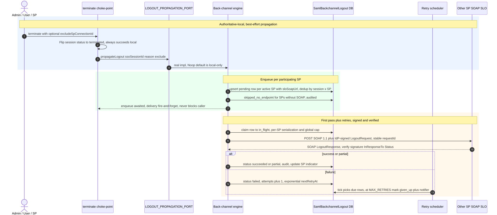
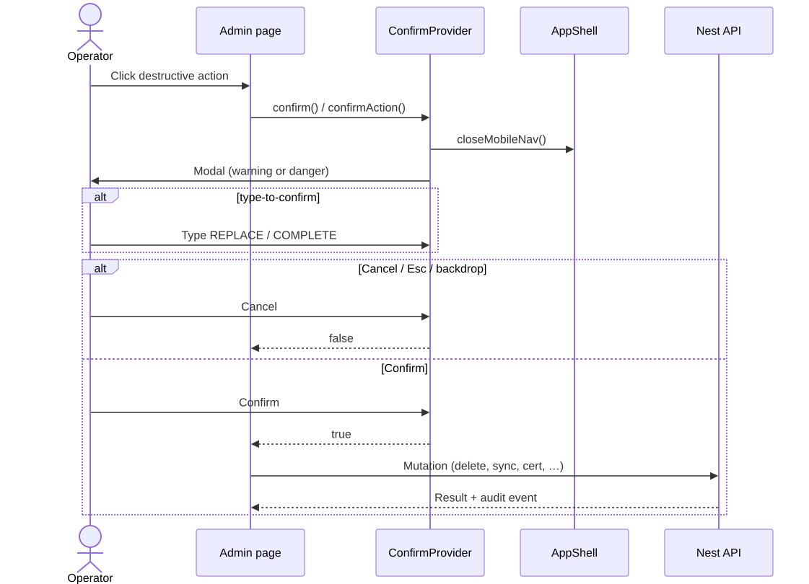
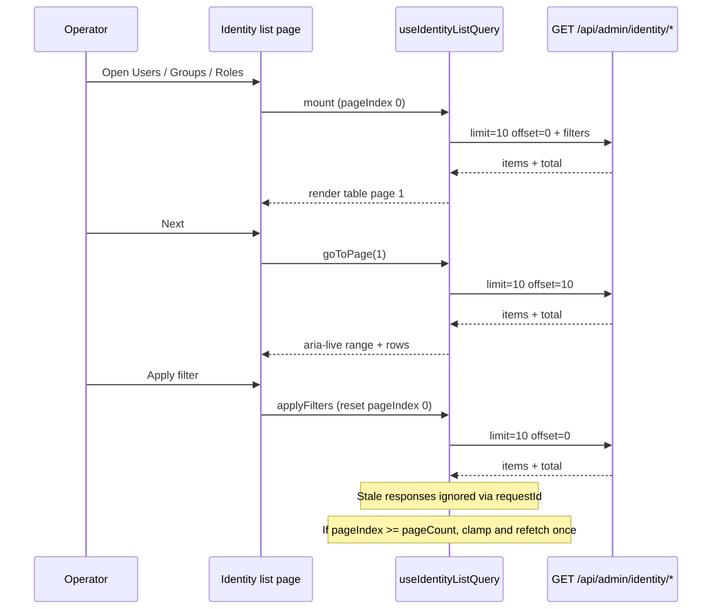

# NestIdP documentation

Product and developer documentation. Visual assets live in [`img/`](./img/) (UI `.png` screenshots + Mermaid `.mmd` / `.svg` diagrams).

**Current release:** v1.20.0

## Start here

| Document                                                   | Description                                                                      |
| ---------------------------------------------------------- | -------------------------------------------------------------------------------- |
| [tutorial.md](./tutorial.md)                               | **Operator walkthrough** — admin UI with screenshots (IdP, sync, SP, SAML login) |
| [proposal.MD](./proposal.MD)                               | Product scope, architecture, data model, roadmap (source of truth)               |
| [development.md](./development.md)                         | Local setup, routing, REST reference, testing, UI registries                     |
| [integration-api.md](./integration-api.md)                 | External identity API v1 contract (bcrypt, endpoints)                            |
| [database.md](./database.md)                               | Encrypted libSQL file, migrations, rekey/backup, bootstrap admin                 |
| [deployment.md](./deployment.md)                           | Docker Compose, migrations, backup/restore                                       |
| [migrations.md](./migrations.md)                           | Migration authoring rules + the §17 migration-safety guard                       |
| [audit-events.md](./audit-events.md)                       | Audit-event naming scheme + full event catalogue (§15)                           |
| [transactional-integrity.md](./transactional-integrity.md) | Every atomic multi-write, its mechanism and proving test (§14)                   |
| [RELEASE.md](./RELEASE.md)                                 | Production go-live checklist                                                     |

## Screenshots

All UI captures: [img/screenshots.md](./img/screenshots.md) · Guided tour: [tutorial.md](./tutorial.md)

## Key diagrams

| Topic                        | Diagram                                                |
| ---------------------------- | ------------------------------------------------------ |
| Monolith layout              |                 |
| API vs SP connections        |         |
| SP-initiated SSO             |                         |
| Sync contract (v1)           |                       |
| Multi-source sync            |  |
| Back-channel SLO propagation |      |
| Sync scheduler tick          |             |
| Scheduler health gauges      |     |
| Data model                   |                    |
| Confirm dialog UX            |       |
| Identity list pagination     |   |

Full diagram index and regenerate commands: [img/README.md](./img/README.md)

```bash
pnpm diagrams:build   # .mmd → .svg
pnpm diagrams:check   # verify SVGs match sources
```

## Examples

| File                                                                                 | Purpose                                       |
| ------------------------------------------------------------------------------------ | --------------------------------------------- |
| [examples/mock-identity-api.mjs](./examples/mock-identity-api.mjs)                   | Standalone mock identity API (legacy script)  |
| [examples/saml-sp-initiated-redirect.mjs](./examples/saml-sp-initiated-redirect.mjs) | Build AuthnRequest URL for manual SSO testing |

Prefer **`mock-app/`** at repo root for the maintained mock server used in Docker dev (`pnpm start` on port 4010).
