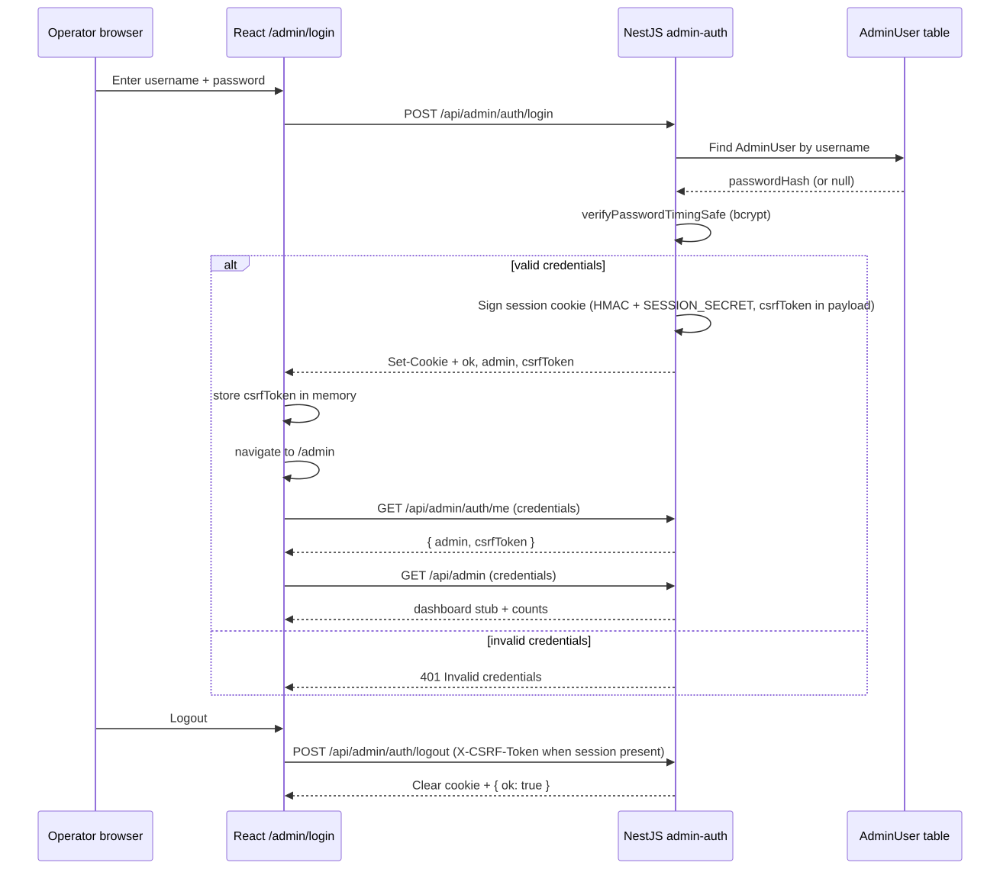
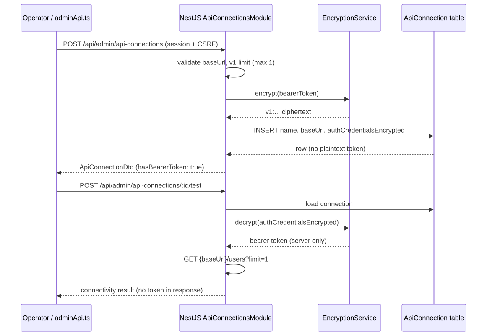

# Development guide

Companion to [proposal.MD](./proposal.MD) for local setup (**v1.1.0** — Phase 1 complete plus Evergreen operator UI: SAML SSO, admin console, Docker deploy, persistent audit log, admin account management).

Integration guide: [integration-api.md](./integration-api.md) · Deploy: [deployment.md](./deployment.md) · Go-live: [RELEASE.md](./RELEASE.md)

Database selection: **[database.md](./database.md)** — SQLite for local dev, PostgreSQL (or SQLite) at deploy time.

Diagram index: **[img/README.md](./img/README.md)** · regenerate with `pnpm diagrams:build`.

## Repository layout

```
apps/api/          NestJS backend (Prisma, SAML stubs, health)
apps/web/          React + Vite (admin + login placeholders)
packages/shared/   Shared TypeScript types and constants
docs/              Product and development documentation
docs/img/          Mermaid (.mmd) sources + committed SVGs
```


## ORM and database

**Prisma** ORM with full MVP schema (12 models including `AuditEvent`). See [database.md](./database.md) and the [ER diagram](./img/schema-entities.svg).

| Variable            | Default (dev)             | Purpose                                 |
| ------------------- | ------------------------- | --------------------------------------- |
| `DATABASE_PROVIDER` | `sqlite`                  | Prisma engine: `sqlite` or `postgresql` |
| `DATABASE_URL`      | `file:../data/nestidp.db` | Connection string matching the provider |

First-time setup after clone:

```bash
cp .env.example .env
mkdir -p apps/api/data
pnpm install
pnpm db:migrate
```

Before `prisma generate` or `prisma migrate`, run:

```bash
pnpm --filter @nestidp/api prisma:prepare
```

This syncs `schema.prisma` with `DATABASE_PROVIDER`. Root `pnpm install` runs `prisma:generate` via `postinstall` but **not** migrate.

## Routing conventions



| Path                         | Handler                                                   |
| ---------------------------- | --------------------------------------------------------- |
| `/api/admin/*`               | Admin REST API (requires session except auth)             |
| `/api/admin/auth/login`      | Operator login (public)                                   |
| `/api/admin/auth/logout`     | Clears session cookie (CSRF when session present)         |
| `/api/admin/auth/me`         | Current admin session + `csrfToken` (protected)           |
| `/api/admin/api-connections` | API connection CRUD + connectivity test                   |
| `/api/admin/sync/*`          | Identity sync trigger, status, logs                       |
| `/api/auth/*`                | End-user login API (synced credentials)                   |
| `/saml/*`                    | SAML protocol (metadata, SP-initiated SSO)                |
| `/api/admin/audit-events`    | Persistent audit log (list + export)                      |
| `/api/admin/admin-users`     | Operator account CRUD                                     |
| `/health`                    | Liveness — always OK, no database                         |
| `/ready`                     | Readiness — Prisma ping                                   |
| `/admin/login`               | React operator login (separate from SAML `/login`)        |
| `/admin/settings/idp`        | IdP settings — entity ID, cert lifecycle, rotation wizard |
| `/admin/settings/admins`     | Operator account management                               |
| `/admin/audit`               | Security and configuration audit log                      |
| `/admin/*`                   | React admin SPA (session gate)                            |
| `/login`                     | React SAML login page                                     |



### End-user auth API (v0.6.0)

| Method | Path                                       | Auth                          | Description                                                                                          |
| ------ | ------------------------------------------ | ----------------------------- | ---------------------------------------------------------------------------------------------------- |
| POST   | `/api/auth/login`                          | —                             | Username + password against synced `User`; optional `{ "samlSessionId" }` binds pending SAML session |
| GET    | `/api/auth/me`                             | `nestidp_user_session` cookie | Profile with group/role names (no secrets)                                                           |
| GET    | `/api/auth/session`                        | —                             | Read-only: `authenticated` + optional `?samlSessionId=` pending SAML state                           |
| POST   | `/api/auth/logout`                         | cookie optional               | Clears end-user session (idempotent)                                                                 |
| POST   | `/api/auth/login/complete-sso`             | end-user session              | Signed SAMLResponse as **text/html** auto-post form to SP ACS                                        |
| GET    | `/saml/metadata`                           | —                             | IdP SAML metadata XML                                                                                |
| GET    | `/saml/sso`                                | —                             | SP-initiated SSO (HTTP-Redirect `SAMLRequest`) → redirect `/login?samlSessionId=`                    |
| GET    | `/api/admin/sp-connections`                | admin session                 | List SP connections                                                                                  |
| POST   | `/api/admin/sp-connections`                | admin session                 | Create SP (CSRF)                                                                                     |
| PATCH  | `/api/admin/sp-connections/:id`            | admin session                 | Update SP (CSRF)                                                                                     |
| DELETE | `/api/admin/sp-connections/:id`            | admin session                 | Delete SP (CSRF)                                                                                     |
| POST   | `/api/admin/sp-connections/:id/test-acs`   | admin session                 | ACS reachability probe (CSRF)                                                                        |
| GET    | `/api/admin/idp/metadata-url`              | admin session                 | Public metadata + SSO URLs for operators                                                             |
| GET    | `/api/admin/idp/settings`                  | admin session                 | IdP settings (fingerprints, rotation status, derived URLs)                                           |
| PATCH  | `/api/admin/idp/settings`                  | admin session                 | Update entity ID / default NameID format (CSRF)                                                      |
| POST   | `/api/admin/idp/settings/signing-cert/*`   | admin session                 | Generate/upload primary cert; rotation start/complete/cancel (CSRF)                                  |
| GET    | `/api/admin/idp/settings/metadata-preview` | admin session                 | Same SAML metadata XML as public `/saml/metadata` (for operator preview)                             |
| GET    | `/api/admin/identity/users`                | admin session                 | Browse users (`?search=`, `?origin=manual\|synced`, `limit`, `offset`)                               |
| POST   | `/api/admin/identity/users`                | admin session + CSRF          | Create **manual** user (`password`, `confirmPassword`, optional `groupIds` / `roleIds`)              |
| GET    | `/api/admin/identity/users/:id`            | admin session                 | User detail (`source`, groups, roles; optional `?auditLimit=1..20`)                                  |
| PATCH  | `/api/admin/identity/users/:id`            | admin session + CSRF          | Update manual user (synced → `403 managed_by_sync`)                                                  |
| DELETE | `/api/admin/identity/users/:id`            | admin session + CSRF          | Delete manual user                                                                                   |
| GET    | `/api/admin/identity/groups`               | admin session                 | Browse groups (`?origin=`, `limit`, `offset`; `memberCount` in items)                                |
| POST   | `/api/admin/identity/groups`               | admin session + CSRF          | Create manual group                                                                                  |
| GET    | `/api/admin/identity/groups/:id`           | admin session                 | Group detail + member usernames                                                                      |
| PATCH  | `/api/admin/identity/groups/:id`           | admin session + CSRF          | Rename manual group                                                                                  |
| DELETE | `/api/admin/identity/groups/:id`           | admin session + CSRF          | Delete manual group (`409` if members)                                                               |
| GET    | `/api/admin/identity/roles`                | admin session                 | Browse roles (`?origin=`, `memberCount`)                                                             |
| POST   | `/api/admin/identity/roles`                | admin session + CSRF          | Create manual role                                                                                   |
| GET    | `/api/admin/identity/roles/:id`            | admin session                 | Role detail + members                                                                                |
| PATCH  | `/api/admin/identity/roles/:id`            | admin session + CSRF          | Rename manual role                                                                                   |
| DELETE | `/api/admin/identity/roles/:id`            | admin session + CSRF          | Delete manual role (`409` if members)                                                                |

Constants:

- **`AUTH_API_PATH`** — `/api/auth`
- **`END_USER_SESSION_COOKIE_NAME`** — `nestidp_user_session`
- **`LOGIN_PAGE_ROUTE`** — `/login`
- **`SAML_SESSION_QUERY_PARAM`** — `samlSessionId` (Prompt 07 redirects here after parsing SAMLRequest)
- **`SAML_SESSION_BIND_PORT`** — Nest token for `SamlSessionBindPort` (Prompt 07 imports from `AuthModule`)

#### End-user login (v1)

- **Login identifier:** `User.username` only (trimmed, **case-sensitive** — `Alice` ≠ `alice`)
- **bcrypt-only** verification via shared `verifyPasswordTimingSafe`
- **Inactive users** (`active: false`) → generic **401** `Invalid username or password`
- **Rate limits:** per-IP (default 10 / 15 min) and per-username (default 5 / 15 min), separate from admin
- **No CSRF** on end-user routes (admin-only in v1)
- **SAML prep:** optional `samlSessionId` on login binds `SamlSession.userId`; SAML XML/POST is **Prompt 07**
- **SP branding:** none in v0.6 (proposal §14 Q3 — single neutral `/login` page)
- **Audit:** dual-write to stdout and persistent **`AuditEvent`** table (browse at `/admin/audit`)

Optional env:

| Variable                                       | Default  | Purpose                      |
| ---------------------------------------------- | -------- | ---------------------------- |
| `END_USER_SESSION_TTL_SECONDS`                 | `3600`   | End-user session cookie TTL  |
| `END_USER_LOGIN_RATE_LIMIT_MAX`                | `10`     | IP failures per window       |
| `END_USER_LOGIN_RATE_LIMIT_WINDOW_MS`          | `900000` | IP window                    |
| `END_USER_LOGIN_RATE_LIMIT_USERNAME_MAX`       | `5`      | Username failures per window |
| `END_USER_LOGIN_RATE_LIMIT_USERNAME_WINDOW_MS` | `900000` | Username window              |

#### Dev proxy and cookies

`apps/web/vite.config.ts` proxies `/api`, `/saml`, `/health`, `/ready` to `VITE_API_PROXY_TARGET` (default `http://localhost:3000`). The login page uses `credentials: 'include'` — browser tests require this proxy (or same-origin production build).

```bash
# After sync created user "alice" with known password
curl -c cookies.txt -X POST http://localhost:3000/api/auth/login \
  -H 'Content-Type: application/json' \
  -d '{"username":"alice","password":"your-password"}'

curl -b cookies.txt http://localhost:3000/api/auth/me
```

#### SAML / SSO (v0.7.0)

1. `GET /saml/sso?SAMLRequest=&RelayState=` — parse AuthnRequest, create `SamlSession`, **302** to `/login?samlSessionId=<cuid>`
2. `POST /api/auth/login` with optional `samlSessionId` — binds `SamlSession.userId`
3. `GET /api/auth/session?samlSessionId=` — `readyToComplete` when bound + authenticated user matches
4. `POST /api/auth/login/complete-sso` (session required) — signed `SAMLResponse` as HTML form POST to `SpConnection.acsUrl`
5. `LoginPage` auto-calls complete-sso after bind or when `readyToComplete` on refresh

**Default SAML attributes** (when `attributeMapping` is null): `email`, `displayName`, `memberOf` (groups), `role` (roles). NameID: email when format is email-oriented, else `username`.

**Operator SP setup:** Admin UI at `/admin/sp-connections` or REST CRUD above. Mock SP URL:

```bash
SP_ENTITY_ID=urn:test:sp node docs/examples/saml-sp-initiated-redirect.mjs
```

| Env var                            | Default | Purpose                                           |
| ---------------------------------- | ------- | ------------------------------------------------- |
| `SAML_ASSERTION_TTL_SECONDS`       | `300`   | Assertion `NotOnOrAfter` window                   |
| `SAML_SESSION_TTL_SECONDS`         | `900`   | Pending `SamlSession` TTL                         |
| `SAML_CLOCK_SKEW_SECONDS`          | `120`   | `IssueInstant` validation skew                    |
| `SAML_METADATA_INCLUDE_ACS`        | `true`  | `AttributeConsumingService` in metadata           |
| `SAML_SESSION_CLEANUP_INTERVAL_MS` | `0`     | Periodic expired-session purge (0 = startup only) |

Inject `@Inject(SAML_SESSION_BIND_PORT)` from `AuthModule` — do not duplicate bind SQL in `SamlModule`.

#### IdP settings and certificate rotation (v0.9.0)

Operator UI: **`/admin/settings/idp`** (sidebar **IdP Settings**). Dashboard shows **`idp.certStatus`** (`missing` | `ok` | `expiring_soon` | `rotation_active`) without a second API call.

**Certificate lifecycle:**

1. **Generate** or **upload** primary signing cert (replaces existing primary when no rotation pending).
2. **Start rotation** — stores pending cert+key; public metadata publishes **two** signing `KeyDescriptor` entries; assertions still sign with **primary** only.
3. **Update SP trust** — distribute metadata; test SSO.
4. **Complete rotation** — pending becomes primary; metadata returns to one cert.
5. **Cancel rotation** — drops pending fields only.

Shared constants: **`IDP_SETTINGS_API_PATH`**, **`IDP_SETTINGS_ROUTE_PREFIX`**, **`IDP_CERT_EXPIRY_WARNING_DAYS`** (30), **`IDP_ROTATION_STALE_WARNING_DAYS`** (7).

Private keys encrypted at rest (`EncryptionService`); admin JSON exposes fingerprints and `notAfter` only — never PEM private keys.

**Rotation runbook (in-page checklist mirrors docs):**

- Verify metadata preview shows two certs during rotation
- Update every SP’s IdP metadata / trust store
- Run at least one SP-initiated login
- Complete rotation only after the above

`IdpSettings.nameIdFormat` affects **metadata only**; assertion NameID still comes from each **`SpConnection.nameIdFormat`**.

### Admin REST API (v1.0.0)

Full operator surface:

| Method | Path                                   | Auth    | CSRF  | Description                                           |
| ------ | -------------------------------------- | ------- | ----- | ----------------------------------------------------- |
| POST   | `/api/admin/auth/login`                | —       | —     | Operator login                                        |
| POST   | `/api/admin/auth/logout`               | session | yes\* | Logout (\*when session cookie present)                |
| POST   | `/api/admin/auth/change-password`      | session | yes   | Self-service password change (current + new)          |
| GET    | `/api/admin/auth/me`                   | session | —     | Session + `csrfToken`                                 |
| GET    | `/api/admin`                           | session | —     | Dashboard (`AdminDashboardResponseDto`)               |
| GET    | `/api/admin/api-connections`           | session | —     | List API connections                                  |
| POST   | `/api/admin/api-connections`           | session | yes   | Create connection (**v1: max 1**)                     |
| GET    | `/api/admin/api-connections/:id`       | session | —     | Get connection                                        |
| PATCH  | `/api/admin/api-connections/:id`       | session | yes   | Update connection                                     |
| DELETE | `/api/admin/api-connections/:id`       | session | yes   | Delete connection                                     |
| POST   | `/api/admin/api-connections/:id/test`  | session | yes   | Connectivity probe (`GET {baseUrl}/users?limit=1`)    |
| POST   | `/api/admin/sync/:connectionId`        | session | yes   | Trigger identity sync (optional `{ "dryRun": true }`) |
| GET    | `/api/admin/sync/:connectionId/status` | session | —     | Sync status + latest log                              |
| GET    | `/api/admin/sync/:connectionId/logs`   | session | —     | List sync logs (`?limit=`, default 20, max 100)       |
| GET    | `/api/admin/sync/logs/:syncLogId`      | session | —     | Get sync log detail                                   |
| GET    | `/api/admin/admin-users`               | session | —     | List operator accounts (no password hashes)           |
| POST   | `/api/admin/admin-users`               | session | yes   | Create operator (rate limited)                        |
| PATCH  | `/api/admin/admin-users/:id`           | session | yes   | Reset another admin’s password                        |
| DELETE | `/api/admin/admin-users/:id`           | session | yes   | Delete operator (not last / not self)                 |
| GET    | `/api/admin/audit-events`              | session | —     | Paginated audit log (`?category=`, `since`, …)        |
| GET    | `/api/admin/audit-events/export`       | session | —     | Export JSON/CSV (max 10_000 rows)                     |

Constants in `@nestidp/shared`:

- **`API_CONNECTIONS_API_PATH`** — REST base (`/api/admin/api-connections`)
- **`SYNC_API_PATH`** — identity sync REST base (`/api/admin/sync`)
- **`API_CONNECTION_ROUTE_PREFIX`** — React UI route (`/admin/api-connections`)
- **`SP_CONNECTION_ROUTE_PREFIX`** — React UI route (`/admin/sp-connections`)
- **`IDENTITY_ROUTE_PREFIX`** — React UI route (`/admin/identity`)
- **`IDP_SETTINGS_ROUTE_PREFIX`** — React UI route (`/admin/settings/idp`)
- **`IDP_SETTINGS_API_PATH`** — REST base (`/api/admin/idp/settings`)
- **`ADMIN_USERS_API_PATH`** — `/api/admin/admin-users`
- **`ADMIN_USERS_ROUTE_PREFIX`** — `/admin/settings/admins`
- **`AUDIT_EVENTS_API_PATH`** — `/api/admin/audit-events`
- **`AUDIT_ROUTE_PREFIX`** — `/admin/audit`
- **`ADMIN_CSRF_HEADER_NAME`** — `X-CSRF-Token` on mutating admin calls




Bearer tokens are encrypted at rest (AES-256-GCM via `ENCRYPTION_KEY`); API responses expose `hasBearerToken: true` but **never** the plaintext token.

### Identity sync semantics (v1)

- **Full snapshot sync** per run — no incremental/delta filter on `GET /users` (proposal §14 Q1 resolved)
- **Soft-deactivate** users missing from the latest snapshot (`active: false`, memberships cleared) — never hard-delete (§14 Q2)
- **bcrypt-only** `passwordHashAlgorithm` from external API (§14 Q5)
- **Email normalization** — trim + lowercase before persist
- **`SYNC_MAX_USERS_PER_RUN`** (default 10000) caps snapshot size
- **`durationMs`** on `SyncLogDto` is computed in API responses (not a DB column)
- **`dryRun: true`** — fetches external API, writes `SyncLog`, but does **not** mutate `User`/`Group`/`Role` or `lastSyncAt`
- **Concurrency** — only one real sync per connection; stale `IN_PROGRESS` runs auto-fail after `SYNC_STALE_RUN_MINUTES` (default 30)
- **Partial errors** — per-user failures go to `SyncLog.errors[]`; run completes with `SUCCESS` unless fetch/decrypt fails
- **Upsert failure** skips groups/roles fetch for that user
- External contract: [integration-api.md](./integration-api.md) (proposal [§7.2](./proposal.MD))

Optional env:

| Variable                 | Default | Purpose                                |
| ------------------------ | ------- | -------------------------------------- |
| `SYNC_HTTP_TIMEOUT_MS`   | `30000` | Outbound HTTP timeout per request      |
| `SYNC_STALE_RUN_MINUTES` | `30`    | Stale sync recovery threshold          |
| `SYNC_MAX_USERS_PER_RUN` | `10000` | Max users in one `GET /users` response |

### Local mock identity API (dev / CI)

```bash
# Terminal 1
node docs/examples/mock-identity-api.mjs

# Terminal 2 — create connection with baseUrl http://localhost:4001, bearerToken test-token
# Then POST /api/admin/sync/:connectionId
```

See [docs/examples/mock-identity-api.mjs](./examples/mock-identity-api.mjs).

### Admin session cookies and CSRF

Operator sessions use signed HTTP-only cookie **`nestidp_admin_session`** (HMAC-SHA256 + `SESSION_SECRET`). The signed payload includes a **`csrfToken`** (v0.4.0+).

| Environment            | `Secure` cookie flag                                |
| ---------------------- | --------------------------------------------------- |
| `production`           | `true` (HTTPS required per proposal §10.2)          |
| `development` / `test` | `false` — allows `http://localhost` with Vite proxy |

On login and `GET /me`, the API returns the same `csrfToken` in JSON. The web client (`adminApi.ts`) stores it in memory and sends **`X-CSRF-Token`** on `POST`, `PATCH`, and `DELETE`.

Vite dev server proxies `/api` to Nest; admin fetches must use **`credentials: 'include'`** (see `apps/web/src/admin/adminApi.ts`).

First boot: set `ADMIN_USERNAME` / `ADMIN_PASSWORD` in `.env` — bootstrap creates the first admin when the table is empty. Change default password after deploy. Additional operators: `/admin/settings/admins` or `POST /api/admin/admin-users`.

Optional production / ops env:

| Variable                                 | Default    | Purpose                                                 |
| ---------------------------------------- | ---------- | ------------------------------------------------------- |
| `TRUST_PROXY`                            | `false`    | `true` / `1` — trust one reverse-proxy hop for `req.ip` |
| `AUDIT_RETENTION_DAYS`                   | `90`       | Purge `AuditEvent` rows older than N days               |
| `AUDIT_CLEANUP_INTERVAL_MS`              | `86400000` | Retention job interval; `0` = startup only              |
| `ADMIN_USER_CREATE_RATE_LIMIT_MAX`       | `5`        | Max `POST /admin-users` per window                      |
| `ADMIN_USER_CREATE_RATE_LIMIT_WINDOW_MS` | `900000`   | Admin create rate window                                |
| `MIGRATE_ONLY`                           | `0`        | `1` — migrate and exit (Docker init job)                |

**v1 single-connection limit:** only one `ApiConnection` row may exist until multi-source sync (Phase 3). A second `POST` returns **409 Conflict**.

**Production `baseUrl`:** when `NODE_ENV=production`, API connection `baseUrl` must use `https:`.

There is **no** global `/api` prefix on the Nest app. Controllers use full path segments.

#### curl example (login → create → test)

```bash
COOKIE_JAR=$(mktemp)

# Login
LOGIN=$(curl -s -c "$COOKIE_JAR" -X POST http://localhost:3000/api/admin/auth/login \
  -H 'Content-Type: application/json' \
  -d '{"username":"admin","password":"YOUR_PASSWORD"}')
CSRF=$(echo "$LOGIN" | jq -r .csrfToken)

# Create API connection
curl -s -b "$COOKIE_JAR" -X POST http://localhost:3000/api/admin/api-connections \
  -H "Content-Type: application/json" \
  -H "X-CSRF-Token: $CSRF" \
  -d '{"name":"Corp HR","baseUrl":"https://identity.example.com","bearerToken":"secret-token"}'

# List connections (no CSRF on GET)
curl -s -b "$COOKIE_JAR" http://localhost:3000/api/admin/api-connections

# Connectivity test (replace CONNECTION_ID)
curl -s -b "$COOKIE_JAR" -X POST "http://localhost:3000/api/admin/api-connections/CONNECTION_ID/test" \
  -H "X-CSRF-Token: $CSRF"

# Trigger identity sync (replace CONNECTION_ID)
curl -s -b "$COOKIE_JAR" -X POST "http://localhost:3000/api/admin/sync/CONNECTION_ID" \
  -H "Content-Type: application/json" \
  -H "X-CSRF-Token: $CSRF" \
  -d '{}'

# Dry run (no DB changes)
curl -s -b "$COOKIE_JAR" -X POST "http://localhost:3000/api/admin/sync/CONNECTION_ID" \
  -H "Content-Type: application/json" \
  -H "X-CSRF-Token: $CSRF" \
  -d '{"dryRun":true}'

# Poll sync status
curl -s -b "$COOKIE_JAR" "http://localhost:3000/api/admin/sync/CONNECTION_ID/status"

# List sync logs
curl -s -b "$COOKIE_JAR" "http://localhost:3000/api/admin/sync/CONNECTION_ID/logs?limit=10"
```

### Upgrading from v0.4.0

| Change              | Action                                                                 |
| ------------------- | ---------------------------------------------------------------------- |
| New sync endpoints  | No migration; configure API connection then `POST /api/admin/sync/:id` |
| External API        | Must implement fixed v1 contract ([§7.2](./proposal.MD))               |
| Stuck `IN_PROGRESS` | Wait `SYNC_STALE_RUN_MINUTES` or trigger sync after stale recovery     |
| Large directories   | Tune `SYNC_MAX_USERS_PER_RUN` and `SYNC_HTTP_TIMEOUT_MS`               |

### Upgrading from v0.3.0

| Change                                                       | Action                                                                   |
| ------------------------------------------------------------ | ------------------------------------------------------------------------ |
| CSRF in session payload                                      | All operators **must re-login** after upgrade; old cookies cannot mutate |
| `ApiConnection` rows with dummy `TEST_ENCRYPTED_CREDENTIALS` | **DELETE** and recreate via API, or **PATCH** with new `bearerToken`     |
| `ENCRYPTION_KEY`                                             | Must be set and **kept stable** — changing it invalidates stored tokens  |
| New env in `.env.example`                                    | Merge any missing vars from updated `.env.example`                       |

## Health and readiness edge cases

| Scenario             | `/health` | `/ready`             |
| -------------------- | --------- | -------------------- |
| API running, DB down | 200       | 503 `disconnected`   |
| `DATABASE_URL` empty | 200       | 503 `not_configured` |
| DB reachable         | 200       | 200 `connected`      |
| Migrations not run   | 200       | 503 `disconnected`   |

`/health` never calls Prisma. The API starts even when the database is unavailable; only `/ready` reflects DB state.

## SAML module

Custom NestJS `SamlModule` (xmlbuilder2 + xml-crypto) — SP-initiated SSO, signed assertions, metadata. Flow: [sso-flow.svg](./img/sso-flow.svg) (see [proposal.MD](./proposal.MD) §6.2). `/saml/slo` remains unimplemented (501).

## Evergreen UI (v1.1.0+, admin forms complete in v1.1.3)

Operator console and SAML login use the **Evergreen** design system: CSS tokens under `apps/web/src/styles/evergreen/`, React primitives under `apps/web/src/ui/` (import from `ui/index.ts` barrel). No Tailwind or runtime CSS-in-JS.

**v1.1.3+:** all admin CRUD/filter pages must use `ui/` primitives (`TextInput`, `Button`, `Select`, `TextArea`, `Checkbox`, `Fieldset`, `Panel`); raw HTML form controls are not styled.



| Topic                                  | Location                                                                         |
| -------------------------------------- | -------------------------------------------------------------------------------- |
| Design tokens, breakpoints, components | `apps/web/src/styles/evergreen/`                                                 |
| Reusable UI                            | `apps/web/src/ui/`                                                               |
| Status colours                         | `apps/web/src/admin/status-badge.ts` → `Badge`                                   |
| Self-hosted fonts                      | `apps/web/public/fonts/*.woff2` (preloaded in `index.html`; no Google Fonts CDN) |
| Print (audit export preview)           | `styles/evergreen/print.css` — hides sidebar/topbar                              |

Breakpoints: mobile-first; sidebar drawer below **768px** (`AppShell` + menu button); content max-width via `.evg-container`.

### Component chooser

| Need                 | Component                   | Notes                                                              |
| -------------------- | --------------------------- | ------------------------------------------------------------------ |
| Page title + actions | `PageHeader`                | Actions slot right; wrap on mobile                                 |
| Section grouping     | `Panel`                     | Bordered; optional `id` for anchors (e.g. `#change-password`)      |
| Text / password      | `TextInput`                 | `requiredMark`; list filters use visible labels + `fieldClassName` |
| Router CTA           | `ButtonLink`                | Same variants as `Button` on `<Link>` (identity headers, nav)      |
| Multi-line / PEM     | `TextArea`                  | Paste PEM on IdP settings (no file picker in v1.1.3)               |
| Dropdown             | `Select`                    | NameID format, audit category, mapping presets                     |
| Boolean flag         | `Checkbox`                  | SP active, sync dry-run                                            |
| Grouped mapping      | `Fieldset`                  | Attribute mapping editor legend + fields                           |
| Submit / actions     | `Button`                    | `primary` / `secondary` / `danger` / `link`; `size="sm"` in tables |
| Highlight metric     | `StatCard`                  | Dashboard stat grid                                                |
| Floating feedback    | `Toast` via `useToast()`    | Success after POST; not for field validation                       |
| Inline page errors   | `ErrorBanner`               | Top of form; persists until fixed                                  |
| Empty list           | `EmptyState`                | Optional CTA                                                       |
| Loading list/page    | `LoadingState`              | Centred spinner + message                                          |
| Tabular data         | `Table`                     | Horizontal scroll wrapper; wide tables on small viewports          |
| PEM / JSON / logs    | `CodeBlock`                 | Scrollable monospace                                               |
| Sync/cert/API status | `Badge` + `status-badge.ts` | Do not hand-pick colours per page                                  |
| Operator identity    | `OperatorSessionBar`        | Admin shell only, not login pages                                  |

Form busy state: wrap fields in `<fieldset disabled={busy}>` and set `aria-busy` on `<form>` during saves.

### Inline list filters vs audit filters

| Pattern                   | Markup                                                                                                                                                                                                                       | Use when                                           |
| ------------------------- | ---------------------------------------------------------------------------------------------------------------------------------------------------------------------------------------------------------------------------- | -------------------------------------------------- |
| **Identity list filters** | `<form className="evg-inline-form" role="search">` (users only) with visible labels, `TextInput` `fieldClassName="evg-field--grow"`, `Select` `fieldClassName="evg-field--fixed"`, submit **`Apply`** (`Button` `secondary`) | Users / groups / roles browse pages                |
| **Audit log filters**     | `<details className="evg-filters-panel">` + `<form className="evg-stack inline">` + primary **Filter**                                                                                                                       | Collapsible, multi-field filters on `AuditLogPage` |

Shared CSS: `--evg-control-height` aligns inputs, selects, and buttons in `.evg-inline-form`; `@media (max-width: 480px)` stacks fields full width. While refetching after **Apply**, disable filter controls and set `aria-busy="true"` on the form.

Footer cross-links: **`IdentitySectionNav`** (`apps/web/src/admin/components/IdentitySectionNav.tsx`) with `ButtonLink variant="link"`.

Vitest registry **`WEB-IDN-UI-01`–`58`**: **`01`–`24`** in `identity-list-toolbar.test.tsx`
(toolbar layout, a11y, keyboard submit); **`25`–`52`** in `identity-ui-edge-extended.test.tsx`
(static guards, synced/manual detail and forms, filter busy states, CSS contracts); **`53`–`57`**
in `button-link.test.tsx`; **`45`**, **`46`**, **`58`** in `IdentitySectionNav.test.tsx`.

Future **`FileInput`** (v1.2): if operators need PEM file picker, use `evg-file-input` + `FileReader` — no API change.

Dark mode is deferred to v1.2.0 (light theme only in 1.1.0).

### Internationalization (v1.3.0)

Operator console and SAML login use **i18next** + **react-i18next**. Catalog: `apps/web/src/i18n/locales/*.json` (14 namespaces per file). Constants: `@nestidp/shared` (`SUPPORTED_LOCALES`, `LOCALE_STORAGE_KEY`, `BROWSER_LOCALE_SENTINEL`).

| Code                                     | Language                            |
| ---------------------------------------- | ----------------------------------- |
| `en`                                     | English (default + fallback)        |
| `cs`                                     | Czech (`cz` browser tag → `cs`)     |
| `sk`                                     | Slovak (distinct catalog from `cs`) |
| `de`, `fr`, `es`, `pl`, `it`, `pt`, `nl` | EU locales                          |

**Resolution order:** `localStorage` `nestidp.locale` (manual pick) → `navigator.languages` → `en`. **LanguageSelect** first option **Browser default** clears storage and re-detects from the browser.

**Add a string:** edit `en.json` first, copy keys to all nine other locale files, run `pnpm check:i18n-keys`. Use `t('key', { ns: 'namespace' })` or `useTranslation('namespace')`. API errors: `formatAdminApiError` / `formatAuthApiError` in `api-error-messages.ts` plus `errors.*` keys. Enum Select labels: `enum-labels.ts` + `enums.*` (machine `value`, translated label).

**Czech / Slovak review:** translations must not be copy-paste between `cs` and `sk`.

**Tests:** `WEB-I18N-01`–`40` (`resolve-locale.test.ts`, `i18n.integration.test.tsx`, `i18n-edge.test.ts`); `API-I18N-01` in shared. Vitest setup: `apps/web/src/test/setup-i18n.ts` forces `en` so existing `WEB-EVG-*` / `WEB-IDN-*` stay stable.

**Visual CI:** existing Playwright PNGs stay **English** (`addInitScript` sets `en`). Non-English smoke: `e2e/i18n-login-cs.spec.ts` (`WEB-I18N-37`).

**Out of scope:** API `Accept-Language`, `hreflang`, RTL, server-stored operator locale.

Regenerate locale JSON after editing `scripts/i18n-locale-catalog.mjs`:

```bash
node scripts/build-i18n-locale-json.mjs
pnpm check:i18n-keys
```

### Web tests and visual baselines

Vitest IDs **`WEB-EVG-01`–`171`** cover primitives, styles, conventions (static grep), toast,
identity form pages (`WEB-EVG-169`–`171`), and **`WEB-IDN-MAN-20`–`28`** (manual CRUD UI). API Jest
registry **`API-IDN-MAN-01`–`55`** and **`API-IDN-MAN-SAML-01`** cover manual CRUD, sync isolation,
local directory, validation edge cases, and SAML login for manual users. Web registry
**`WEB-IDN-MAN-01`–`28`** plus **`WEB-EVG-169`–`171`** cover identity forms and operator UX.
mutation flows, Login SSO UI states, dashboard badge mappers, admin form migrations, extended admin
form edge cases, and infra checks.
Existing **`WEB-ADM-*`** / **`WEB-AUTH-*`** must stay green.

| Range                      | Focus                                                                                                                                                                                                     |
| -------------------------- | --------------------------------------------------------------------------------------------------------------------------------------------------------------------------------------------------------- |
| `01`–`23`                  | Core Evergreen acceptance (AppShell, primitives, styles, Playwright/bundle infra)                                                                                                                         |
| `24`–`37`                  | UI primitive edge cases (all `Button`/`Badge` variants, form errors, `Panel` anchors)                                                                                                                     |
| `38`–`40`                  | Static conventions (no legacy CSS classes, barrel imports, `main.tsx` entry)                                                                                                                              |
| `41`–`46`                  | Toast on six admin mutation flows (API/SP/sync/admins/IdP/audit export)                                                                                                                                   |
| `47`–`50`                  | `status-badge.ts` unknown/fallback/active-flag edges                                                                                                                                                      |
| `51`–`53`, `15`            | `ToastProvider` queue max 3, `aria-live`, `useToast` guard                                                                                                                                                |
| `54`–`57`, `70`            | `AppShell` drawer scrim, logout, a11y, `OperatorSessionBar` deep link                                                                                                                                     |
| `58`–`60`                  | `print.css` + dark-theme deferral                                                                                                                                                                         |
| `61`–`72`                  | Barrel exports, bundle script, Playwright PNGs, Login SSO, Dashboard badges                                                                                                                               |
| `73`–`108`                 | Admin form static guards, `Checkbox`/`Fieldset`, per-page `*.evergreen-forms.test.tsx`, a11y smoke, six Playwright baselines, diagram                                                                     |
| `109`–`118`                | `Checkbox`/`Fieldset`/`TextInput` edge cases (`checkbox-fieldset-edge.test.tsx`)                                                                                                                          |
| `119`–`168`                | Admin form edge cases: save/busy, Panel titles, IdP rotation/expiry, sync dry-run, badges, static barrel guards (`admin-forms-evergreen-edge.test.tsx`, `AttributeMappingEditor.evergreen-edge.test.tsx`) |
| `153`–`153c`               | Identity list **Apply** button variant on users, groups, roles                                                                                                                                            |
| `WEB-IDN-UI-01`–`24`       | Identity inline filters, `ButtonLink`, section nav, a11y, keyboard submit (`identity-list-toolbar.test.tsx`)                                                                                              |
| `WEB-IDN-UI-25`–`52`       | Extended identity UI: static `evg-btn` guard, list/detail/form `ButtonLink`, filter busy/error, CSS (`identity-ui-edge-extended.test.tsx`)                                                                |
| `WEB-IDN-UI-53`–`57`       | `ButtonLink` variants, sizes, class merge (`button-link.test.tsx`)                                                                                                                                        |
| `WEB-IDN-UI-45`–`46`, `58` | `IdentitySectionNav` current-section omission and `aria-label` (`IdentitySectionNav.test.tsx`)                                                                                                            |
| `WEB-I18N-01`–`40`         | i18n resolve, integration, key parity, bundle lazy chunks, `LanguageSelect` (`src/i18n/*.test.ts`)                                                                                                        |
| `WEB-I18N-41`–`52`         | Extended locale resolution: regional tags, `normalizeBrowserTag`, `resolveDisplayLocale` (`resolve-locale.test.ts`)                                                                                       |
| `WEB-I18N-53`–`64`         | `formatAdminApiError`, `formatAuthApiError`, `resolveI18nKey` (`api-error-messages.test.ts`)                                                                                                              |
| `WEB-I18N-65`–`74`         | Enum Select labels and cert/origin badges (`enum-labels.test.ts`)                                                                                                                                         |
| `WEB-I18N-75`–`78`         | Locale JSON namespace parity and mismatch detection (`i18n-key-parity.test.ts`)                                                                                                                           |
| `WEB-I18N-79`–`98`         | Static guards, bootstrap, cs≠sk catalog (`i18n-edge-extended.test.ts`)                                                                                                                                    |
| `WEB-I18N-99`–`115`        | Extended UI integration across admin pages (`i18n.integration.extended.test.tsx`)                                                                                                                         |
| `API-I18N-01`–`05`         | Shared locale constants (`packages/shared/src/i18n.spec.ts`)                                                                                                                                              |

```bash
pnpm --filter @nestidp/web test
pnpm check:i18n-keys
pnpm --filter @nestidp/web build
node scripts/check-web-bundle-size.mjs   # main index-*.js ≤ 650 KB raw; locale JSON in separate chunks
pnpm --filter @nestidp/web exec playwright install chromium
pnpm --filter @nestidp/web test:e2e:visual
# Intentional UI changes:
pnpm --filter @nestidp/web test:e2e:visual:update
```

Committed screenshots: `apps/web/e2e/screenshots/*.png` (seven baselines: login, dashboard, API connection form, IdP settings, identity users list).

## Testing

```bash
pnpm test
pnpm diagrams:check
```

- `@nestidp/shared` — schema enums, password hash constants, route prefixes, database validation
- `@nestidp/api` — unit tests, schema integration tests (SQLite temp DB), optional PostgreSQL smoke (`POSTGRES_TEST_URL`), e2e routing (mocked Prisma)
- `@nestidp/web` — React route tests (admin vs login separation), Evergreen `WEB-EVG-*` registry

Integration tests live under `apps/api/src/prisma/*.integration.spec.ts` and run as part of `pnpm test`.

CI (`.github/workflows/ci.yml`) runs lint, test (with Postgres service), build, web bundle size check, Playwright visual baselines, and `diagrams:check` on push/PR to `main`.

## Git hooks

Once per clone, install repo hooks (strip / block AI co-author trailers in commit messages):

```bash
./scripts/setup-githooks.sh
```

This sets `core.hooksPath=.githooks`. Hooks run on `prepare-commit-msg` and `commit-msg` — commits are **rejected** if `Co-authored-by: Cursor`, `cursoragent@cursor.com`, or similar attribution remains.

## Docker

- **Default dev:** SQLite — no containers required; `pnpm dev` on the host
- **Full stack:** `docker compose up --build` — PostgreSQL + NestIdP (migrations via entrypoint). See [deployment.md](./deployment.md)
- **Host dev + Postgres only:** `docker compose up -d postgres` then `pnpm dev` with `DATABASE_PROVIDER=postgresql`
- **`MIGRATE_ONLY=1`:** run migrations without starting HTTP (init containers)
- **`TRUST_PROXY`:** set `true` when behind a TLS-terminating reverse proxy

Copy `.env.docker.example` → `.env.docker` for compose secrets.

## Phase 1 complete — what’s next

Phase 1 (MVP) is **done** in v1.0.0. Phase 2 items (scheduled sync, configurable API contract, outbound proxy, SAMLRequest signature verify, IdP-initiated SSO, SLO) are tracked in [proposal.MD §13](./proposal.MD).
