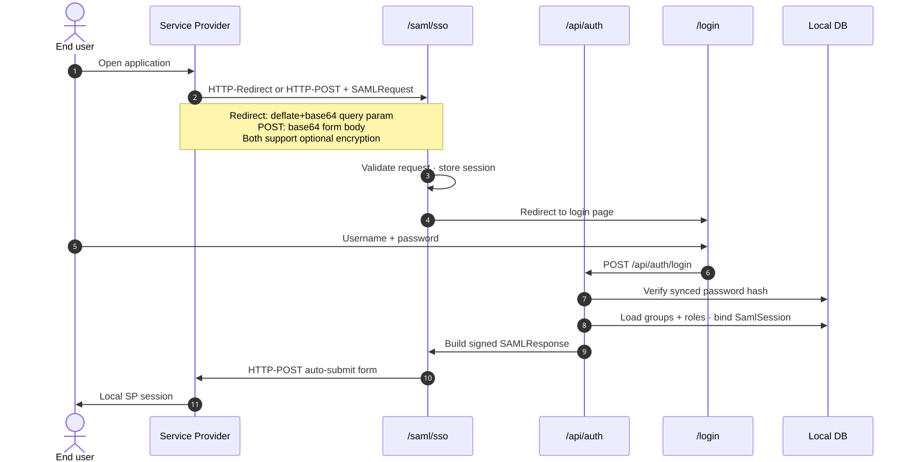

# NestIdP — Project Proposal

## 1. Executive Summary

**NestIdP** is a deployable SAML Identity Provider (IdP) delivered as a single monolithic application consisting of a NestJS backend and a React frontend. It provides:

- An **administration console** for operators to configure identity sources, SAML applications, and attribute mappings.
- A **standalone SAML login page** where end users authenticate when redirected from a Service Provider (SP).
- A **SAML assertion issuance flow** that, upon successful authentication, produces a SAML Response and posts it back to the requesting SP application.

The system synchronizes users, groups, and roles from externally configured REST APIs into a local database. Password hashes returned by those APIs during sync are stored locally and used to authenticate users at login time.

This document describes the product scope, architecture, core flows, data model, security considerations, deployment strategy, and a phased delivery roadmap.

---

## 2. Problem Statement

Organizations often operate user and authorization data in internal APIs or backend services, while individual applications (SPs) need a standards-based single sign-on (SSO) mechanism. Building a full identity platform (e.g. Okta, Keycloak) is unnecessary for many use cases.

NestIdP addresses the gap between a minimal SAML configuration tool and an enterprise identity platform by providing:

- A focused SAML IdP with a login experience under our control.
- An admin UI to wire up external identity APIs and SAML-consuming applications.
- A single deployable unit suitable for cloud or on-premise hosting.

---

## 3. Goals and Non-Goals

### 3.1 Goals

| Goal | Description |
|------|-------------|
| **Deployable IdP** | Single Docker image (or equivalent) deployable to common hosting platforms. |
| **SAML IdP** | Issue signed SAML 2.0 assertions to configured Service Providers. |
| **Admin console** | Web UI for all operator-facing configuration. |
| **Identity sync** | Pull users, groups, roles, and password hashes from configured REST APIs. |
| **SAML login page** | Dedicated React page for end-user authentication during SP-initiated SSO. |
| **Monolithic delivery** | One repository, one build, one deployment artifact. |

### 3.2 Non-Goals (v1)

| Non-Goal | Rationale |
|----------|-----------|
| OIDC / OAuth 2.0 | Out of scope for initial release; SAML only. |
| Multi-tenant SaaS | Single deployment instance per environment in v1. |
| Social login, MFA | Deferred to future phases. |
| Configurable API contract mapping | v1 uses a fixed REST contract; endpoint/field mapping deferred to v2. |
| Outbound HTTP proxy for sync | Implemented (v1.14.0) — opt-in per API connection, off by default; routes sync/OAuth/test traffic with a `noProxyHosts` bypass. |
| Multiple identity APIs for sync | v1 and v2: one API connection per sync; merge from multiple sources in v3. |
| SCIM / LDAP connectors | Deferred; v1 uses REST only. |
| Microservices architecture | Unnecessary complexity for initial scope. |
| Full identity platform features | No billing, org hierarchies, app marketplace, etc. |

---

## 4. Product Overview

NestIdP serves two distinct audiences:

| Audience | Interface | Purpose |
|----------|-----------|---------|
| **Operator / Admin** | Admin SPA (`/admin`) | Configure API connections, sync identity data, manage SP connections, view sync status. |
| **End User** | SAML Login Page (`/login`) | Authenticate when redirected from a Service Provider during SSO. |
| **Service Provider** | SAML endpoints (`/saml/*`) | Receive SAML Responses; consume IdP metadata. |

### 4.1 Two Types of Connections

A common source of confusion is mixing **identity sources** with **SAML applications**. These are separate concepts and must be separate sections in the admin UI.



#### API Connection (Identity Source)

- **Direction:** External API → NestIdP (inbound sync)
- **Purpose:** Define where users, groups, roles, and password hashes come from.
- **Protocol:** REST (fixed contract in v1 — see Section 7)
- **Configured by admin (v1):** Base URL, authentication credentials, manual sync trigger.
- **Configured by admin (v2):** Endpoint paths, response field mapping, sync schedule, outbound HTTP proxy.

The IdP **reads** from API connections. It does not send SAML data to them.

In v1 the sync engine calls **hardcoded** paths (`/users`, `/users/:id/groups`, `/users/:id/roles`) and expects **fixed JSON field names**. The external API must adapt to this contract; NestIdP does not yet let the admin remap endpoints or fields.

**v1 sync scope:** exactly **one API connection** is active for identity sync. Multiple external APIs merged into one directory is a v3 feature (Section 7.6).

#### SP Connection (SAML Application)

- **Direction:** NestIdP → Service Provider (outbound assertion)
- **Purpose:** Define which applications may authenticate users via this IdP.
- **Protocol:** SAML 2.0
- **Configured by admin:** SP Entity ID, ACS URL, signing certificate, NameID format, attribute mapping (groups, roles, email, etc.).

The IdP **sends** SAML Responses to SP connections after successful login.


---

## 5. Architecture

### 5.1 High-Level Architecture

NestIdP is a **monolith**: NestJS serves the REST API, SAML endpoints, and the built React static assets (Admin SPA + Login Page).



### 5.2 Technology Stack

| Layer | Technology |
|-------|------------|
| Backend | NestJS (TypeScript) |
| Frontend | React + Vite (TypeScript) |
| Database | Encrypted libSQL file via Prisma + `@prisma/adapter-libsql` (embedded, at-rest encrypted) |
| SAML (IdP) | Custom NestJS `SamlModule` — see Section 5.5 |
| SAML XML/signing | `xmlbuilder2`, `xml-crypto` (>= 6.0.1), `@xmldom/xmldom`, `xpath` |
| ORM | Prisma |
| Package management | pnpm workspaces (monorepo) |
| Containerization | Docker + docker-compose |
| Session | HTTP-only secure cookies |

### 5.3 Repository Structure

```
nest-idp/
├── apps/
│   ├── api/                    # NestJS application
│   │   └── src/
│   │       ├── admin/          # Admin API (API connections, SP connections)
│   │       ├── auth/           # Admin auth + end-user login
│   │       ├── sync/           # Identity sync from external APIs
│   │       ├── saml/           # Custom IdP SAML module (see Section 5.5)
│   │       │   ├── saml.module.ts
│   │       │   ├── saml.controller.ts
│   │       │   ├── saml-request-parser.service.ts
│   │       │   ├── saml-response-builder.service.ts
│   │       │   ├── saml-metadata.service.ts
│   │       │   └── saml-post-binding.service.ts
│   │       ├── identity/       # Users, groups, roles (local store)
│   │       └── main.ts
│   └── web/                    # React application
│       └── src/
│           ├── admin/          # Admin console pages
│           └── login/          # SAML login page
├── packages/
│   └── shared/                 # Shared types, constants, validation schemas
├── docs/
│   └── proposal.MD
├── docker-compose.yml
├── Dockerfile
└── package.json
```

### 5.4 Routing (Production)

| Path | Handler | Description |
|------|---------|-------------|
| `/api/admin/*` | NestJS Admin API | Protected; operator configuration. |
| `/api/auth/*` | NestJS Auth API | End-user login, session management. |
| `/saml/metadata` | NestJS SAML Module | IdP metadata XML (public). |
| `/saml/sso` | NestJS SAML Module | SSO endpoint; receives SAMLRequest. |
| `/saml/slo` | NestJS SAML Module | Single Logout (SP-initiated; admin session termination). |
| `/login` | React Login Page | End-user authentication UI. |
| `/admin/*` | React Admin SPA | Operator configuration UI. |
| `/*` | React fallback | SPA routing for admin. |

### 5.5 SAML Module (Custom IdP Implementation)

NestIdP acts as a **SAML 2.0 Identity Provider**. We do **not** use off-the-shelf IdP libraries such as `samlify` or `@node-saml/node-saml` — the latter is primarily designed for **Service Provider** flows (consuming assertions from external IdPs), not issuing them.

Instead, SAML IdP behaviour is implemented as a dedicated NestJS **`SamlModule`** with a thin layer over low-level XML libraries. This keeps full control over XML shape, signing, and dynamic configuration loaded from the database (SP connections, certificates, attribute mapping).

#### Design decision

| Approach | Verdict |
|----------|---------|
| `samlify` | Not used — avoids third-party IdP abstraction; past CVE surface in SAML libraries |
| `@node-saml/node-saml` | Not used — SP-focused; poor fit for assertion issuance |
| **Custom `SamlModule`** | **Chosen** — explicit, testable, aligns with admin-driven config from DB |

#### Dependencies

| Package | Role |
|---------|------|
| `xmlbuilder2` | Build SAMLResponse, Assertion, and IdP metadata XML |
| `xml-crypto` (>= 6.0.1) | Sign assertions and responses (patched for SAMLStorm CVEs) |
| `@xmldom/xmldom` | Parse incoming SAMLRequest XML |
| `xpath` | Select elements during request validation |

#### Services

| Service | Responsibility |
|---------|----------------|
| `SamlRequestParserService` | Decode HTTP-Redirect SAMLRequest (deflate + base64), parse XML, validate `Issuer`, `Destination`, `ID` |
| `SamlResponseBuilderService` | Build SAMLResponse + Assertion; set Conditions, AuthnStatement, attributes from synced user/groups/roles |
| `SamlMetadataService` | Generate IdP metadata XML from DB config (entity ID, SSO URL, signing cert) |
| `SamlPostBindingService` | Render HTML auto-submit form for HTTP-POST delivery to SP ACS URL |

#### MVP scope (SamlModule)

Included in v1:

- SP-initiated SSO (HTTP-Redirect in, HTTP-POST out)
- Signed assertions
- IdP metadata endpoint
- Attribute mapping per SP connection
- `InResponseTo` validation against server-side SAML session

Implemented (v1.8.0):

- Single Logout (SLO) — SP-initiated (HTTP-Redirect + HTTP-POST) with signature verification, plus admin-initiated session termination (local invalidate). Revocable server-side SSO sessions.

Deferred (Phase 2+):

- Back-channel (SOAP) SLO and multi-SP front-channel logout propagation
- IdP-initiated SSO
- SAMLRequest signature verification (optional hardening)

---

## 6. Core Flows

### 6.1 Identity Sync Flow

The operator configures an API connection in the admin console. Sync can be triggered manually or on a schedule (cron).



```
Admin UI  →  POST /api/admin/api-connections  →  save connection config
Admin UI  →  POST /api/admin/sync/:connectionId  →  trigger sync

Sync Service (v1 — fixed contract):
  1. Authenticate to external API (Bearer token)
  2. GET {baseUrl}/users              → upsert users (including password hash)
  3. GET {baseUrl}/users/:id/groups   → upsert group memberships
  4. GET {baseUrl}/users/:id/roles    → upsert role assignments
  5. Record sync timestamp, status, errors in audit log

Endpoint paths and JSON field names are not configurable in v1.
```

**Password handling during sync:**

- The external API returns a password hash per user (see Section 7 for API contract).
- NestIdP stores the hash in the local database.
- At login time, the IdP verifies the submitted plaintext password against the stored hash using the same algorithm parameters indicated by the API (e.g. bcrypt cost factor).
- Plaintext passwords are never stored and never logged.

### 6.2 SP-Initiated SSO Flow (Primary)

This is the main authentication flow. The Service Provider redirects the user to the IdP.



```
Step  Actor              Action
────  ─────              ──────
 1    End User           Opens SP application (e.g. ReportPortal)
 2    SP                 No valid session → redirects to IdP SSO URL
                         with SAMLRequest (HTTP-Redirect binding)
 3    NestIdP            Validates SAMLRequest, stores RelayState +
                         SAMLRequest in server-side session
 4    NestIdP            Redirects user to /login (React login page)
 5    End User           Enters username + password on login page
 6    Login Page         POST /api/auth/login { username, password }
 7    NestIdP Auth       Verifies password against synced hash in DB
 8    NestIdP Auth       Loads user groups and roles from local DB
 9    NestIdP SAML       Builds signed SAMLResponse with attributes
10    NestIdP            Returns HTML auto-submit form (HTTP-POST binding)
                         POST SAMLResponse + RelayState to SP ACS URL
11    SP                 Validates assertion, creates local session
12    End User           Logged into SP application
```

**Important:** The SAML Response MUST be delivered via **HTTP-POST binding** (auto-submit HTML form), not as a query parameter on a redirect URL. This is standard practice and prevents assertion leakage via browser history or referrer headers.

### 6.3 Admin Configuration Flow

```
Operator  →  /admin/login  →  authenticate (separate admin credentials)
Operator  →  /admin/api-connections  →  create/edit API connection
Operator  →  /admin/api-connections/:id/sync  →  trigger identity sync
Operator  →  /admin/sp-connections  →  create/edit SP connection
Operator  →  /admin/sp-connections/:id  →  configure attribute mapping
Operator  →  copy IdP metadata URL  →  provide to SP administrator
```

Admin authentication is separate from end-user SAML authentication. Admin credentials are managed locally within NestIdP (not synced from external API in v1).

---

## 7. External API Contract (Identity Source)

### 7.0 Version roadmap (API connections)

| Aspect | v1 (MVP) | v2 | v3 |
|--------|----------|-----|-----|
| Endpoint paths | **Fixed** — `/users`, `/users/:id/groups`, `/users/:id/roles` | **Configurable per API connection (v1.9.0)** | Same as v2 |
| Response field mapping | **Fixed** — field names below | **Configurable incl. nested dot-paths (v1.9.0)** | Same as v2 |
| Auth to external API | Bearer token only | **Bearer token or OAuth 2.0 Client Credentials (v1.10.0)** | Same as v2 |
| Outbound proxy | **None** — direct HTTP to `baseUrl` | Optional HTTP/HTTPS proxy per connection | Same as v2 |
| **Number of sync sources** | **One** API connection | **One** API connection | **Multiple** API connections merged into local identity store |
| What admin configures | `baseUrl` + token | + endpoints, field mapping, proxy | + multi-source sync groups and merge rules |

**v1 rule:** the external identity API must implement the contract exactly as defined below. NestIdP only prepends the configured `baseUrl`.

**v2 goal:** admin defines how to reach users, groups, and roles on arbitrary APIs without code changes.

Adapters for other protocols (SCIM, LDAP) remain deferred beyond v2 unless explicitly added to the roadmap.

### 7.1 Authentication to External API

Configured per API connection:

- **Bearer token** (static API key) — the default.
- **OAuth 2.0 Client Credentials** (implemented — v1.10.0) — the IdP exchanges `client_id` +
  `client_secret` at the API's token endpoint (`client_secret_post` or `client_secret_basic`, optional
  `scope`/`audience`/extra params) for a short-lived access token, caches it until shortly before
  expiry, and refreshes once on a `401`. The client secret is stored encrypted and never returned to
  the SPA or logged.

### 7.2 Fixed Endpoints (v1)

#### List Users

```
GET /users
Authorization: Bearer <token>

Response 200:
[
  {
    "id": "usr_001",
    "username": "jdoe",
    "email": "jdoe@example.com",
    "displayName": "John Doe",
    "passwordHash": "$2b$12$...",
    "passwordHashAlgorithm": "bcrypt",
    "active": true
  }
]
```

#### List Groups for User

```
GET /users/:id/groups
Authorization: Bearer <token>

Response 200:
[
  { "id": "grp_001", "name": "developers" },
  { "id": "grp_002", "name": "admins" }
]
```

#### List Roles for User

```
GET /users/:id/roles
Authorization: Bearer <token>

Response 200:
[
  { "id": "role_001", "name": "editor" },
  { "id": "role_002", "name": "viewer" }
]
```

### 7.3 Configurable Contract (implemented — v1.9.0)

Per API connection, the admin can override the fixed v1 contract (stored as
`ApiConnection.apiContractConfig`; `null` ⇒ the v1 default, so existing connections are
unchanged):

- Custom endpoint paths (e.g. `/api/v1/accounts`, `/api/v1/accounts/:id/memberships`) with an `:id` placeholder
- JSON field mapping incl. nested dot-paths (e.g. external `profile.login` → internal `username`, `credentials.hash` → `passwordHash`)
- Response envelope (`responseRoot` dot-path to the array) + fixed query params
- Extra request headers (non-secret; `Authorization` reserved)
- Bounded offset/page pagination
- Embedded groups/roles (read from the user payload — avoids per-user calls)
- Status→active mapping (value list / inverted), field defaults, per-user membership caps
- Row-error policy (`skip` default = record + continue; `fail` = abort)
- The **Test connection** action validates the contract (parsed user count, first mapping error, no-password preview)

The canonical internal model and validation (bcrypt password hash, supported algorithms) are unchanged.

### 7.4 Outbound Proxy (implemented — Prompt 33, v1.14.0)

Some deployments require identity APIs to be reached through a corporate HTTP/HTTPS proxy. Admin configures this **per API connection** (not globally). It is opt-in and off by default; existing deployments connect directly with no change. When enabled, **all** outbound calls for that connection — sync fetches, the OAuth token exchange, and the Test connection / Test token / Test proxy diagnostics — traverse the proxy.

| Field | Description |
|---------|-------------|
| `proxyEnabled` | Toggle the proxy for this connection (off by default) |
| `proxyUrl` | Absolute `http://`/`https://` proxy URL (e.g. `http://proxy.corp.example:8080`); no inline credentials |
| `proxyUsername` | Optional Basic proxy auth username |
| `proxyPasswordEncrypted` | Optional Basic proxy auth password — **encrypted at rest** in the libSQL DB, write-only, never returned/logged |
| `noProxyHosts` | Comma-separated bypass patterns: exact host, `host:port`, leading-dot suffix, `*`, IPv4/IPv6 CIDR; `localhost`/`127.0.0.1`/`::1` always bypass |
| `lastProxyCheckStatus` / `lastProxyCheckAt` | Last "Test proxy" outcome + timestamp (proxy-health badge) |

Implemented with Node 20's global `fetch` + an `undici` `ProxyAgent` dispatcher (one cached agent per connection, closed on config change/delete/shutdown). `AbortSignal.timeout` still bounds every request; a separate `connectTimeout` fast-fails a dead proxy. Proxy credentials follow the same encryption rules as API connection tokens. SOCKS/PAC and NTLM/Kerberos proxy auth remain out of scope (Basic only).

### 7.6 Multiple API Sources (v3 — planned)

Deferred to Phase 3. Today each sync run pulls from **one** API connection. v3 allows the operator to register **multiple API connections** and sync from all of them into the shared local user/group/role store.

Example use cases:

- Users from HR API + roles from permissions API
- Gradual migration from old user service to new one (both synced during cutover)

Planned admin capabilities (v3):

- Enable multiple API connections for sync (not limited to one active source)
- Define sync order or parallel sync per connection
- Conflict rules when the same `username` or `externalId` appears in more than one source (e.g. primary source wins, last sync wins, manual merge)

Open design details (user/group/role ownership per source, deactivation when removed from one API but not another) to be resolved before implementation.

### 7.7 Password Hash Requirements

| Field | Requirement |
|-------|-------------|
| `passwordHash` | Non-empty string; hash only, never plaintext. |
| `passwordHashAlgorithm` | Supported in v1: `bcrypt`. Extensible for `argon2`, `pbkdf2`. |
| Sync behavior | Upsert on every sync; hash updated if changed in source API. |
| Deactivation | Users with `active: false` are disabled in IdP; cannot log in. |

---

## 8. SAML Configuration

SAML protocol behaviour is implemented by the custom NestJS `SamlModule` (Section 5.5). Configuration below defines what the module reads from the database at runtime.

### 8.1 IdP Settings (Global)

| Setting | Description |
|---------|-------------|
| Entity ID | Unique IdP identifier (e.g. `https://idp.example.com`) |
| SSO URL | `{baseUrl}/saml/sso` |
| Metadata URL | `{baseUrl}/saml/metadata` |
| Signing certificate | X.509 cert + private key (PEM); used to sign assertions |
| Encryption certificate | Optional X.509 + private key (PEM); published as `md:KeyDescriptor use="encryption"` in metadata (no lazy generate on SSO) |
| NameID format | Default: `urn:oasis:names:tc:SAML:1.1:nameid-format:emailAddress` |

### 8.2 SP Connection Settings (Per Application)

| Setting | Description |
|---------|-------------|
| SP Entity ID | Unique identifier of the Service Provider |
| ACS URL | Assertion Consumer Service URL (POST binding) |
| SP certificate | SP public key PEM; required when `wantAssertionsEncrypted` is enabled — IdP encrypts assertions to this key (v1.7.0) |
| wantAssertionsEncrypted | Per SP; when true, IdP encrypts signed assertions with SP certificate PEM (AES-256-CBC, RSA-OAEP-MGF1P key transport, v1.7.0) |
| NameID format | Override per SP if needed |
| Attribute mapping | Map local fields → SAML attributes (see below) |

### 8.3 Default Attribute Mapping

| Local Field | SAML Attribute | NameFormat |
|-------------|----------------|------------|
| `email` | `email` | `urn:oasis:names:tc:SAML:2.0:attrname-format:basic` |
| `displayName` | `displayName` | basic |
| `groups[].name` | `memberOf` | basic (multi-valued) |
| `roles[].name` | `role` | basic (multi-valued) |

Attribute mapping is configurable per SP connection in the admin UI.

### 8.4 Certificate Management

- IdP signing material is **self-signed only** (in-app generate) or **operator-uploaded PEM** — no external CA in v1.
- Operators generate certificates in admin with selectable **RSA or EC** key, **XML-DSig signature algorithm** (RSA/ECDSA with SHA-1/256/384/512), and **expiry date** (today through +10 years; default ~2 years).
- Upload infers key family and algorithm from PEM; SAML assertions sign with the **primary** algorithm until rotation completes.
- Support for two active signing certificates during rotation (old + new both published in metadata until cutover).
- **Encryption certificate (optional):** separate from signing; RSA or EC key; RSA key transport algorithm catalog (RSA-OAEP variants) stored for future assertion encryption; self-signed generate or PEM upload; independent dual-cert rotation; metadata publishes `use="encryption"` descriptors when configured. Does **not** replace the per-SP certificate used to encrypt assertions to that SP.
- Private keys stored encrypted at rest in the database or in a secrets manager.

See [idp-certificates.svg](./img/idp-certificates.svg) for how signing, IdP encryption, and SP certificates relate.

---

## 9. Data Model



### 9.1 Core Entities

```
ApiConnection
  id, name, baseUrl, authType, authCredentials (encrypted),
  lastSyncAt, lastSyncStatus, createdAt, updatedAt
  -- v2 adds: endpointMapping (JSON), fieldMapping (JSON), syncSchedule,
  --          proxyEnabled, proxyUrl, proxyUsername, proxyPasswordEncrypted, noProxyHosts

User
  id, externalId, apiConnectionId, username, email, displayName,
  passwordHash, passwordHashAlgorithm, active, createdAt, updatedAt

Group
  id, externalId, apiConnectionId, name, createdAt, updatedAt

Role
  id, externalId, apiConnectionId, name, createdAt, updatedAt

UserGroup (join)
  userId, groupId

UserRole (join)
  userId, roleId

SpConnection
  id, name, spEntityId, acsUrl, spCertificate, nameIdFormat,
  attributeMapping (JSON), active, createdAt, updatedAt

AdminUser
  id, username, passwordHash, createdAt, updatedAt

SyncLog
  id, apiConnectionId, startedAt, finishedAt, status, usersSynced,
  groupsSynced, rolesSynced, errors (JSON)

SamlSession
  id, samlRequestId, relayState, spConnectionId, userId,
  expiresAt, createdAt
```

### 9.2 Entity Relationships

```
ApiConnection  1 ──── * User
ApiConnection  1 ──── * Group
ApiConnection  1 ──── * Role
User           * ──── * Group   (via UserGroup)
User           * ──── * Role   (via UserRole)
SpConnection   1 ──── * SamlSession
User           1 ──── * SamlSession
```

---

## 10. Security

### 10.1 Authentication Boundaries

| Context | Mechanism |
|---------|-----------|
| Admin console | Local admin credentials; HTTP-only session cookie |
| End-user login | Username + password verified against synced hash |
| SP → IdP | SAMLRequest signature validation (if SP signs requests) |
| IdP → SP | SAMLResponse signed with IdP private key |
| Sync → External API | Bearer token / client credentials (encrypted at rest); v2 optional proxy auth (encrypted at rest) |

### 10.2 Security Requirements

- **HTTPS only** in all environments (TLS termination at load balancer or app).
- **HTTP-only, Secure, SameSite** cookies for all sessions.
- **Password hashes only** — plaintext passwords never persisted or logged.
- **Encrypted storage** for API credentials and IdP private keys.
- **SAML assertion lifetime** — short `NotOnOrAfter` window (e.g. 5 minutes).
- **Clock skew tolerance** — configurable (default ±120 seconds).
- **CSRF protection** on admin mutating endpoints.
- **Rate limiting** on `/api/auth/login` to prevent brute force.
- **Audit log** for admin actions and sync events.

### 10.3 Admin vs End-User Separation

Admin accounts and end-user accounts are stored in separate tables with separate authentication flows. An admin logging into the admin console does not trigger a SAML flow. An end user logging in via the SAML login page has no access to the admin console.

---

## 11. Admin UI — Page Structure

From **v1.1.0**, the operator console and SAML login page use the **Evergreen** responsive design system (CSS tokens + `apps/web/src/ui` components). See [development.md § Evergreen UI](./development.md#evergreen-ui-v110).

**v1.3.2** — Admin app shell: fixed sidebar on desktop (`≥768px`), main-pane scroll only; mobile drawer and burger below 768px (`WEB-RSP-*` tests).

```
/admin
├── /login                        Admin authentication
├── /dashboard                    Sync status, SP count, user count
├── /api-connections
│   ├── /                         List API connections
│   ├── /new                      Create API connection (baseUrl + Bearer token)
│   ├── /:id                      Edit connection (v1: baseUrl + token only)
│   └── /:id/sync                 Trigger sync + view sync log
│                                 (v2: endpoint + field mapping + proxy on /:id)
├── /sp-connections
│   ├── /                         List SP connections
│   ├── /new                      Create SP connection
│   └── /:id                      Edit SP + attribute mapping
├── /identity
│   ├── /users                    Browse users; manual CRUD via /new and /:id/edit (synced read-only)
│   ├── /users/new                Create manual user (password + memberships)
│   ├── /users/:id                User detail (source, groups, roles, recent audit)
│   ├── /users/:id/edit           Edit manual user (synced → read-only message)
│   ├── /groups                   Browse groups with origin filter; link to detail
│   ├── /groups/new               Create manual group
│   ├── /groups/:id               Group detail + members (synced: read-only + callout)
│   ├── /groups/:id/edit          Edit manual group
│   ├── /roles                    Browse roles with origin filter
│   ├── /roles/new                Create manual role
│   ├── /roles/:id                Role detail + members
│   └── /roles/:id/edit           Edit manual role
└── /settings
    ├── /idp                      IdP entity ID, certificates, metadata URL
    └── /admins                   Manage admin accounts
```

Login page (separate from admin):

```
/login?samlRequest=...&relayState=...
  Username field
  Password field
  Submit → POST /api/auth/login → SAML Response POST back to SP
```

---

## 12. Deployment

### 12.1 Deployment Model

Single Docker container running the NestJS process. The datastore is an **encrypted libSQL file** on a persistent volume — no separate database service.

```
┌─────────────────────┐
│   Load Balancer     │
│   (TLS termination) │
└─────────┬───────────┘
          │
          ▼
┌─────────────────────┐       ┌─────────────────────┐
│   NestIdP container │──────▶│ Encrypted libSQL    │
│   (NestJS + React)  │       │ file (docker volume)│
└─────────────────────┘       └─────────────────────┘
```

### 12.2 Environment Variables

| Variable | Description |
|----------|-------------|
| `DATABASE_URL` | `file:` path to the libSQL database file (see `docs/database.md`) |
| `DATABASE_ENCRYPTION_KEY` | At-rest encryption key for the DB file (required in production) |
| `SESSION_SECRET` | Cookie signing secret |
| `ENCRYPTION_KEY` | Key for encrypting stored credentials and private keys |
| `IDP_BASE_URL` | Public base URL (e.g. `https://idp.example.com`) |
| `NODE_ENV` | `production` / `development` |

### 12.3 Target Platforms

Any platform supporting Docker containers with a persistent volume (the encrypted libSQL file is embedded — no managed database needed):

- Fly.io
- Railway
- Render
- AWS ECS / Fargate
- Azure App Service
- Self-hosted VPS (docker-compose)

### 12.4 Initial Setup (First Deploy)

1. Deploy container + database.
2. Run database migrations.
3. Access admin console; create first admin account (bootstrap endpoint or env seed).
4. Configure IdP settings (entity ID, generate signing certificate).
5. Add API connection; trigger first sync.
6. Add SP connection; provide IdP metadata URL to SP administrator.
7. Test SP-initiated SSO end-to-end.

### 12.5 Operator distribution (deferred)

Today, contributors and early adopters use the **git monorepo** and `docker compose` from source. That is sufficient for development and internal pilots.

**Product distribution for real operators** (customers, integrators, on-prem teams who should not clone and build the repo) is planned as a **final roadmap phase** — see **Phase 4** below. It starts only after the major product work in Phases 2 and 3 is done (or explicitly reprioritized). Until then, deployment remains **Docker-first** as documented in `docs/deployment.md` and `docs/RELEASE.md`.

---

## 13. Phased Roadmap

### Phase 1 — MVP

_Phase 1 complete in **v1.0.0** (Prompt 10 — Docker, persistent audit, admin accounts UI)._

- [x] NestJS monolith scaffold (API + static serving)
- [x] React Admin SPA (API connections, SP connections, IdP settings, audit log, admin accounts)
- [x] React SAML login page (SP-initiated SSO completion)
- [x] Prisma schema and migrations (encrypted libSQL via driver adapter)
- [x] API connection CRUD (baseUrl + Bearer token)
- [x] Manual identity sync from one active source
- [x] Manual identity CRUD in admin (local directory; synced records read-only) — v1.2.0
- [x] User/group/role upsert via **fixed** v1 REST contract (with password hash)
- [x] End-user login against synced credentials
- [x] **Custom `SamlModule`** — parse SAMLRequest, build/sign SAMLResponse, metadata, POST binding (xmlbuilder2 + xml-crypto)
- [x] SP-initiated SSO (HTTP-Redirect in, HTTP-POST out)
- [x] IdP metadata endpoint
- [x] Signed SAML assertions with attribute mapping
- [x] Admin authentication (local)
- [x] Docker + docker-compose for local dev and deployment
- [x] Basic audit log — `SyncLog` for sync runs + persistent `AuditEvent` for admin/security/SAML events (dual-write to stdout)
- [x] Web SPA i18n — 10 locales (`en`, `cs`, `sk`, `de`, `fr`, `es`, `pl`, `it`, `pt`, `nl`), browser language detection, English fallback — v1.3.0
- [x] Responsive app shell — fixed sidebar, mobile drawer, `WEB-RSP` tests — v1.3.2

### Phase 2 — Hardening and Configurable API Contract

- [x] **Configurable API contract** — endpoint paths, JSON field mapping, envelope, headers, pagination, embedded memberships per API connection (v1.9.0)
- [x] **Outbound HTTP proxy** — optional proxy URL + Basic auth + `noProxyHosts` (incl. CIDR) per API connection; routes sync, OAuth, and test traffic; password encrypted at rest; per-connection `ProxyAgent` dispatcher (v1.14.0)
- [x] **Scheduled sync (cron)** — per-connection cron schedule with IANA timezone, in-process scheduler, pause / dry-run / jitter / failure auto-pause, survives restarts, no catch-up (v1.13.0)
- [ ] Certificate rotation (dual-cert in metadata)
- [ ] Rate limiting and brute-force protection
- [ ] Sync error reporting in admin UI
- [x] **OAuth 2.0 Client Credentials for API connections** — token-endpoint exchange, caching, 401 refresh, per-connection config (v1.10.0)
- [ ] IdP-initiated SSO
- [x] Single Logout (SLO) — SP-initiated + admin session termination (v1.8.0)
- [ ] Back-channel (SOAP) SLO + multi-SP logout propagation

### Phase 3 — Extensibility

- [x] **External identity database** — relocate or mirror users/groups/roles to an external Postgres/MySQL database, attached at runtime from the admin console (v1.12.0)
- [ ] **Multiple API connections for sync** — merge users, groups, and roles from more than one identity API into the local store
- [ ] Additional hash algorithms (argon2, pbkdf2)
- [ ] SCIM connector
- [ ] Multi-tenant support
- [ ] OIDC support

### Phase 4 — Product distribution (after Phases 2–3)

_Deferred. Do not start until the planned feature work in Phases 2 and 3 is complete (or the roadmap is revised). v1 already ships a single Docker image from source; this phase **productizes** how non-developers obtain and upgrade NestIdP._

**Goal:** Operators install a **versioned artifact** (e.g. `1.2.1`), not “pull `main` and build.” Contributors keep using the git monorepo.

- [ ] **Semver GitHub Releases** — tag `v*.*.*`, release notes (CHANGELOG), no requirement to clone for deploy
- [ ] **Published OCI images** — immutable image per release (e.g. GHCR), documented pull tag matching semver
- [ ] **Deploy bundle** — release asset or small repo: `docker-compose.yml`, `.env.docker.example`, link to `docs/RELEASE.md` / `docs/deployment.md` (no local `pnpm build` on customer side)
- [ ] **Single official install path** in docs — Docker Compose (or Helm later if needed); “advanced” alternatives clearly secondary
- [ ] **Upgrade runbook** — image bump, env checklist, `prisma migrate deploy`, rollback notes
- [ ] **Optional native packages (DEB/RPM)** — only if a concrete customer requires on-prem without Docker; separate packaging pipeline (systemd, `/etc/nestidp`, data-dir for the libSQL file), not a substitute for the container artifact

**Out of scope for Phase 4 unless separately scoped:** managed/hosted IdP SaaS, multi-distro packaging matrix, Shibboleth-style OS vendor repos.

---

## 14. Open Questions

| # | Question | Impact |
|---|----------|--------|
| 1 | Should sync be full-replace or incremental (delta by `updatedAt`)? | Sync performance and API contract complexity. |
| 2 | What happens to users removed from the external API — soft-delete or hard-delete? | Data retention policy. |
| 3 | Should the login page support SP branding (logo per SP connection)? | UX scope for v1. |
| 4 | ~~Is one API connection sufficient for v1?~~ **Resolved:** v1 and v2 use one sync source; multiple APIs in v3 (Section 7.6). | — |
| 5 | ~~Which bcrypt library/parameters must the external API use in v1?~~ **Resolved:** bcrypt only; `$2a$` / `$2b$` / `$2y$` hashes; recommend cost 12. See [integration-api.md](./integration-api.md). | — |
| 6 | v2 field mapping UI — simple key map or JSONPath-style? | Admin UX and sync engine complexity. |
| 7 | v2 proxy — per API connection only, or also a global default? | Admin UX and sync client implementation. |
| 8 | v3 multi-source sync — conflict resolution when same user exists in two APIs? | Merge strategy and data model. |

---

## 15. Glossary

| Term | Definition |
|------|------------|
| **IdP** | Identity Provider — authenticates users and issues SAML assertions. |
| **SP** | Service Provider — an application that relies on the IdP for authentication. |
| **ACS** | Assertion Consumer Service — SP endpoint that receives the SAML Response. |
| **SAMLRequest** | XML message sent by SP to initiate SSO. |
| **SAMLResponse** | XML message sent by IdP containing the signed assertion. |
| **RelayState** | Opaque value passed through the SSO flow; returned to SP with the assertion. |
| **API Connection** | Configured external REST API used as an identity source (inbound sync). |
| **SP Connection** | Configured SAML application that consumes assertions from this IdP (outbound). |
| **NameID** | SAML element identifying the user; typically email address. |
| **HTTP-POST binding** | SAML delivery method using an auto-submit HTML form (used for SAMLResponse). |
| **HTTP-Redirect binding** | SAML delivery method using URL query parameters (used for SAMLRequest). |

---

## 16. Summary

NestIdP is a focused, deployable SAML Identity Provider built as a NestJS + React monolith. Operators configure two distinct connection types in the admin console: **API connections** (identity sources synced inbound) and **SP connections** (SAML applications receiving outbound assertions). End users authenticate on a dedicated login page; the backend verifies credentials against password hashes synced from the external API and, upon success, issues a signed SAML Response posted back to the requesting Service Provider.

The architecture prioritizes simplicity, a single deployment artifact, and clear module boundaries within the monolith — enabling future extraction or extension without premature complexity.

**Distribution:** Phase 4 will add operator-facing releases (images, deploy bundle, documented upgrade path) once core roadmap features in Phases 2–3 are delivered; until then, Docker from the repository remains the supported deploy path.
