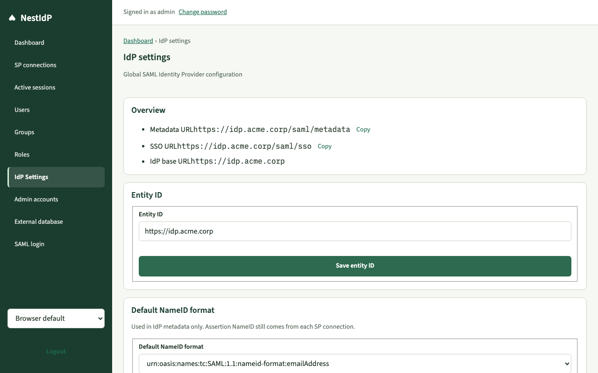
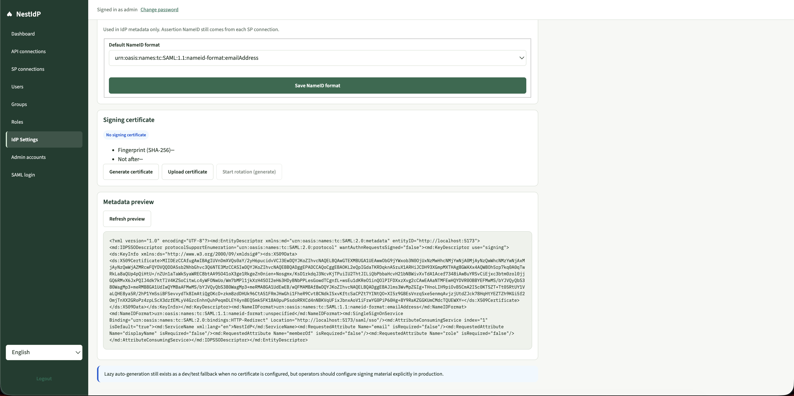
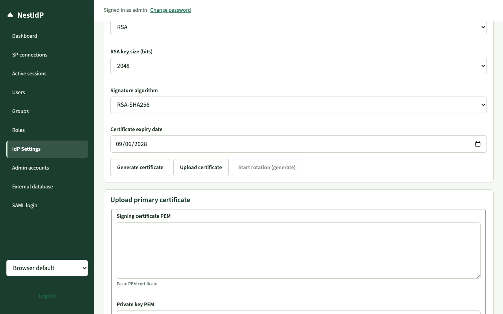
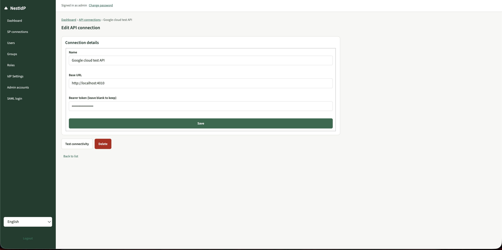
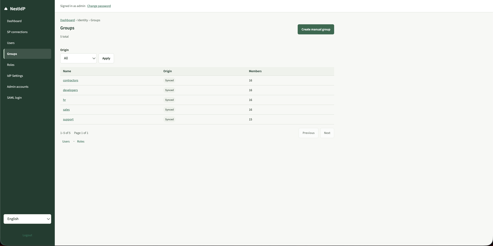
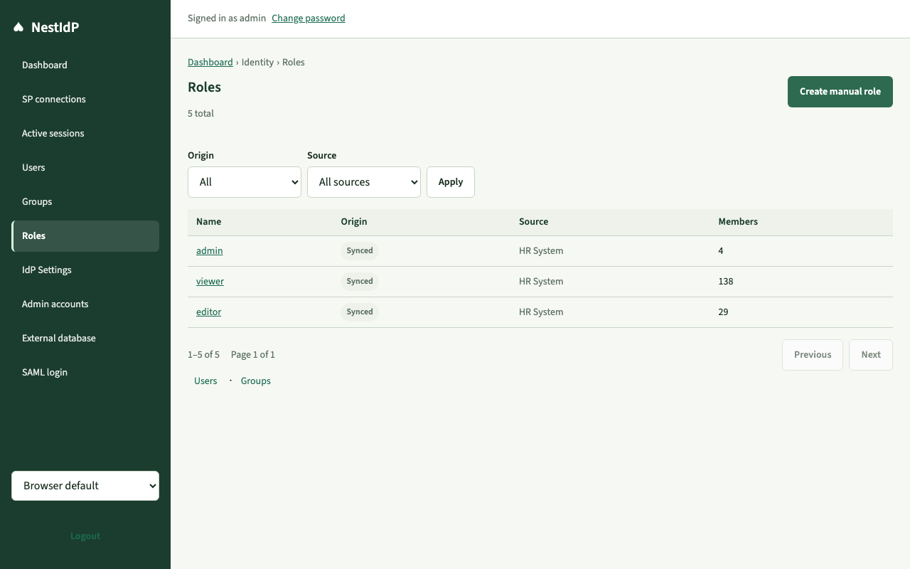
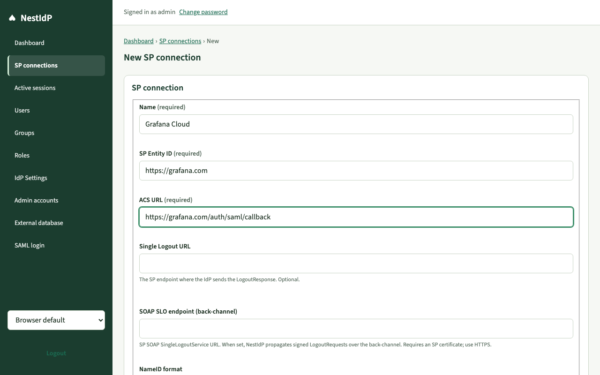

# NestIdP operator tutorial

Step-by-step walkthrough of the admin console and SAML login UI, with screenshots from a local dev stack (`pnpm dev:docker`, mock identity API on port 4010).

**New here?** Start with the [product tour in the root README](../README.md#product-tour), then follow the steps below.

For architecture and API contracts see [proposal.MD](./proposal.MD), [development.md](./development.md), and [integration-api.md](./integration-api.md).

## Before you start

1. Copy `.env.docker.example` to `.env.docker` and set secrets (`SESSION_SECRET`, `ENCRYPTION_KEY`, `ADMIN_PASSWORD`, `IDP_BASE_URL`).
2. Run `pnpm dev:docker` (or `pnpm dev` with SQLite).
3. Optional: start the mock identity API — `cd mock-app && pnpm start` (Bearer token `mock-sync-dev-token`, base URL `http://localhost:4010` from inside Docker via `localhost:host-gateway`).

Open the admin UI at **http://localhost:5173/admin/login** (Vite proxies `/api` and `/saml` to the API).

## 1. Operator login

The operator console is separate from end-user SAML SSO.

Sign in with the bootstrap admin from `ADMIN_USERNAME` / `ADMIN_PASSWORD`. Optional checkboxes: remember username (device only) and stay signed in (longer session cookie).

## 2. Dashboard

After login you land on the dashboard: identity counts, last sync status, and IdP URLs for service providers.

Use **Open sync** to jump to the active API connection sync page. **Configure IdP settings** opens signing certificate and metadata. Footer links browse users and SP connections.

## 3. IdP settings (global SAML IdP)

Configure the Identity Provider once per deployment. Service providers need your **metadata URL**, **SSO URL**, and **Entity ID**.

### Overview

Set **Entity ID** to the public base URL operators and SPs will trust (here `http://localhost:5173` when using the Vite dev server). Save entity ID and default NameID format (metadata only; per-SP NameID still comes from each SP connection).

### Signing certificate and metadata preview

Generate or upload a signing certificate before production SSO. **Generate** lets you pick RSA or EC key type, XML-DSig algorithm (eight options), and a calendar expiry date (up to ten years); defaults are RSA-2048, rsa-sha256, and about two years. The metadata preview shows the XML to give to SPs (e.g. Grafana Cloud).

### Upload certificate (optional)

Paste PEM certificate and private key if you bring your own key material.

Download or copy metadata from the preview (or open `/saml/metadata`) and register it in your SP admin UI.

### Encryption certificate (optional, v1.5.0)

A **second** panel configures an IdP encryption certificate, independent from signing. Use it when partners expect `KeyDescriptor use="encryption"` in metadata. Defaults: RSA-2048, RSA-OAEP-MGF1P key transport, ~two-year expiry. EC keys are supported for metadata; key transport is RSA-only in the UI.

This is **not** the certificate used to encrypt SAML assertions **to** a service provider — that is each SP connection’s **SP certificate** PEM. The admin UI explains the distinction; see [idp-certificates.svg](./img/idp-certificates.svg).

Copy signing options or download/copy the public encryption PEM from the panel. Encrypted assertions at runtime are not enabled yet; `wantAssertionsEncrypted` on SP connections is stored for a future release.

## 4. API connection (identity source)

v1 supports one external API connection for sync (plus a hidden local directory for manual users). Point it at your REST identity API.

Example dev values:

| Field        | Example                 |
| ------------ | ----------------------- |
| Name         | `Mock HR API`           |
| Base URL     | `http://localhost:4010` |
| Bearer token | `mock-sync-dev-token`   |

Use **Test connectivity** before saving. **Delete** uses the in-app confirm dialog (no browser `window.confirm`).

## 5. Identity sync

Trigger a full sync manually from the connection sync page. Dry run validates the API without writing to the database.

After a successful sync, the dashboard shows **last sync SUCCESS** and user/group/role counts update.

## 6. Identity directory (users, groups, roles)

Synced records are read-only in the admin UI; change them in the external API and re-sync. Manual users/groups/roles live in the local directory and are managed on this site.

### Users

### Groups

### Roles

End users authenticate with **username + password** verified against synced bcrypt hashes (see [integration-api.md](./integration-api.md)).

## 7. SP connections (SAML applications)

Register each application that receives SAML assertions from this IdP.

### New connection (example: Grafana Cloud)

Copy **SP Entity ID** and **ACS URL** from the SP’s SAML metadata (not from NestIdP metadata).

Example:

| Field         | Value                                                    |
| ------------- | -------------------------------------------------------- |
| Name          | `Grafana Cloud`                                          |
| SP Entity ID  | `https://<stack>.grafana.net/saml/metadata`              |
| ACS URL       | `https://<stack>.grafana.net/saml/acs`                   |
| NameID format | `urn:oasis:names:tc:SAML:1.1:nameid-format:emailAddress` |
| Active        | checked                                                  |

Optional **attribute mapping** JSON for SP-specific attribute names (e.g. map `username` to SAML attribute `id` if the SP expects it). Default mapping sends `email`, `displayName`, `memberOf`, and `role`.

### SP list

**Test SSO** starts an SP-initiated flow when configured.

## 8. End-user SAML login

When an SP redirects to the IdP, the user signs in on `/login` (not `/admin/login`).

Flow (see also [sso-flow diagram](./img/sso-flow.svg)):

1. SP → `GET /saml/sso?SAMLRequest=…` → redirect to `/login?samlSessionId=…`
2. User → `POST /api/auth/login` with optional `samlSessionId`
3. Browser → `POST /api/auth/login/complete-sso` → auto-post **SAMLResponse** to SP ACS

Example dev user after mock sync: `user001` / `MockPass123!` (email `user001@mock.local`).

## 9. Grafana Cloud checklist (optional)

If the SP is [Grafana Cloud SAML](https://grafana.com/docs/grafana/latest/setup-grafana/configure-access/configure-authentication/saml/):

1. Import NestIdP metadata into Grafana (IdP entity ID must match assertion Issuer, e.g. `http://localhost:5173` in dev).
2. NestIdP SP connection must use Grafana’s **SP Entity ID** (`…/saml/metadata`) and **ACS** (`…/saml/acs`) exactly.
3. Map **Login** and **Email** to `email`; avoid requiring SAML attribute `id` unless you add it in SP attribute mapping.
4. Enable user sign-up / auto-assign in Grafana if new users should be created on first login.

## Next steps

- Production deploy: [deployment.md](./deployment.md) and [RELEASE.md](./RELEASE.md)
- REST details: [development.md](./development.md)
- External API contract: [integration-api.md](./integration-api.md)
